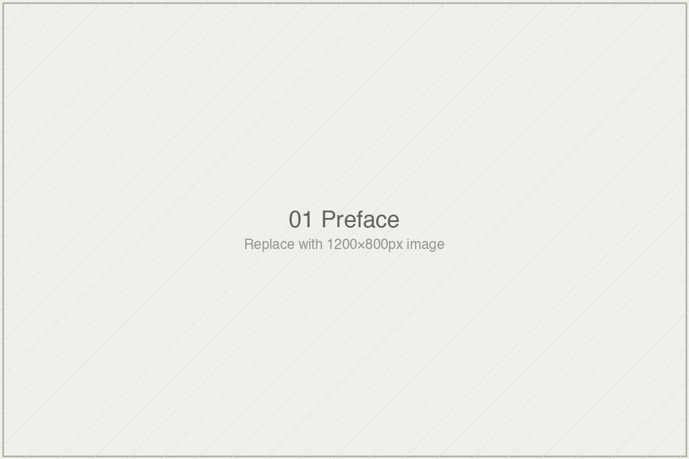

# On the Book's Project, or: *Que sais-je?*

*Essai 1*

---

The essai opens on a sentence Sal Khan said from a TED stage in 2023. I want to quote it the way the essai quotes it, because the essai's whole method is in how the quoting is done.

*Probably the biggest positive transformation that education has ever seen.*

The writer does not refute it. He does not annotate it with eye-rolls. He does not tell you, in that paragraph or the three that follow, that it is wrong. He asks you to notice its shape. The word *biggest* doing the work. The word *probably* doing cover. The implicit comparison reaching back through the printing press and the GI Bill. And then, three years later in the same essai, another sentence from the same speaker: *So far I am not seeing the revolution in education.* The writer does not pounce. He lets the two sentences sit.

That restraint is not an absence. It is a discipline. And it is, I think, the point of the essai — perhaps of the whole book it is opening — before the argument about evidence apparatuses has been made at all.

---

### What the Essai Is, and What It Refuses to Be

This is *Essai 1* of a fourteen-essai volume on how the learning-systems field evaluates its own effectiveness. That sentence is true, and it is also the kind of sentence this essai refuses to end on. What the essai does instead is position you, the reader, with unusual specificity: you are a professional in or adjacent to education technology who has sat in a meeting where Bloom's 2-sigma number was invoked, who has nodded along without quite having the language to push back, who has felt the unease of superlatives that would not quite hold up if you read the original study. The writer tells you he has been that reader. Then he tells you this book is the apparatus he wishes he had had.

What the essai refuses is more revealing than what it claims. It is not a takedown of Khan Academy. It is not a critique of AI in education. It is not a polemic against the technology industry. It is not a prescription for what the field should do. Four refusals in the space of as many paragraphs. Each refusal is named, then set aside. By the time the writer gets to the book's actual thesis — that the field's measurement apparatus is optimized for publication, funding, and rhetorical use rather than for the questions careful readers would actually want answered — you have been walked past so many books this book could have been that the book it is starts to feel inevitable.

Some readers will find that inevitability earned. Others will find it evasive.

I want to name the second response before I settle into the first. The essai spends 4,700 words largely telling you what it will and will not do. That is a long prolegomenon by any standard. The writer is aware of this; he tells you, explicitly, that the second essai is the one that installs the tools. *If you read only one essai in this volume, read the second.* You can hear, in that instruction, both a generosity and an admission. The admission is that this first essai is doing preparatory work. The generosity is that he is telling you so, rather than asking you to perform the patience of not skipping ahead.

Whether you forgive the length of the preparation depends on what you think the preparation is for.

---

### Montaigne's Discipline, and Who Has Kept It

The essai's central formal claim is that it is an essai, not an essay. The distinction carries more weight than it first appears to. Montaigne coined the word in the 1570s from *essayer*, to try. The form he invented was not the magazine essay as we know it now and not the academic monograph either. It was something else: a prose piece that takes a position, follows its implications, and holds the position as provisional — revisable, across editions, in the margins of itself.

The writer names his lineage explicitly. Adam Phillips. Rebecca Solnit. Phil Agre, whose *Computation and Human Experience* he calls the closest intellectual ancestor this book has. John Berger. Maggie Nelson. This is not a throwaway genealogy. It is a claim about what form can do, and which writers have kept the form doing it.

What the Montaignean essai requires, and what the modern magazine essay mostly does not, is that the writer commit in a way that can later be revised. This is harder than it sounds. Committing is easy; revising is easy; committing in a way that makes revision possible, rather than embarrassing, is the discipline. It requires specifying what the commitment depends on. It requires flagging, at the moment of commitment, the evidence the writer is relying on and the readings they have performed. It requires a certain kind of showing-the-work that academic prose flattens and magazine prose romanticizes away.

The writer claims this form for his book. The claim matters because the book's subject is, in part, the rhetorical apparatus of confident-sounding evidence. A monograph on that subject would use the very moves it was critiquing. The essai form offers an out: you can be confident without being falsely so, you can commit without pretending the commitment is final, you can model, in the form itself, the epistemic habit the book is trying to install in the reader.

Here is the question the review has to ask. Does this essai earn the form, or does it invoke the form as a shield?

I think, with qualifications, it earns it. The "What I am not sure about" section at the end is not ornamental. The writer names, specifically, that his reading of the Khan TED sentence may be harder than the sentence warrants, because the sentence was delivered in a TED register rather than a peer-review register. He names that the reader he has positioned in the essai may not be the reader the book actually finds. He names that he expects to be wrong about something in the volume, and that he would rather find out from readers than from reviewers. These are Montaignean moves in the strict sense. They specify what the commitment depends on. They flag the reading for correction.

What I am less sure of is whether the digital-serial format — Substack essais published one at a time, then compiled quarterly into Kindle issues — can actually hold the revisory discipline the form requires. Montaigne revised across editions that took years to appear. Substack revises across the comments section and the next week's post. The rhythms are different. Whether the serial form produces the kind of layered document Montaigne's *Essais* became, or whether it produces a different kind of document that borrows the name without the same architecture, is a question the book will answer by existing or failing to.

The writer flags this too, glancingly, in his closing note. He is not pretending the form is fully solved.

---

### The Moves That Do the Real Work

Come back now to the Khan sentence, and to the essai's treatment of it.

The writer could have refuted it. He could have compiled the counter-evidence. He could have read the Kestin study alongside the TED claim and shown you where the claim exceeded what the evidence allowed. That would have been a legitimate essay. It would not have been this essai.

What this essai does instead is ask you to notice the sentence's shape. That is a different operation. It does not tell you the sentence is wrong. It tells you the sentence is of a type, and that the type has a history, and that the history is older than the sentence's author. By refusing the satisfaction of refutation, the writer makes possible the slower and more useful work of reading.

This is what the essai's restraint is for. The reader who wanted the takedown will leave disappointed. The reader who wanted tools will stay.

The architectural choice to front-load the book's refusals — *this is not a takedown, this is not a polemic* — is of a piece with this. A less careful writer would have let the refusals emerge from the reader's misreadings. This writer heads them off. The cost is a preface that feels, for long stretches, like an inventory of things the book is not. The gain is that when the book begins its actual work — in the second essai, by the writer's own instruction — you are not still expecting the book to do something it was never going to do.

Whether that trade is worth it is, I think, the question this first essai leaves you with.

---

### What It Asks, and What It Costs

What this essai asks of its reader is unusual. It asks you to accept that a first essai can be, in effect, a door. It asks you to trust that the second essai will install the apparatus the first essai promises. It asks you to hold fourteen essais worth of reading against a thesis that has not yet been defended — only sketched. And it asks you, in the closing note, to tell the writer where he has gotten things wrong.

That last ask is the one I want to end on.

Most book prefaces close on a flourish. This one closes on a request for correction. The writer names what he is not sure of. He points you to the comments on the Substack page. He tells you that the quarterly Kindle compilation will incorporate the discussion into the record — in marginal corrections, or in a "from the discussion" section, or in whatever form the response apparatus turns out to call for.

That is not humility. Humility performs itself. This is something stranger: a writer building the revision apparatus into the form, and telling you in advance where to find it.

Whether the discipline holds across fourteen essais, I do not yet know. Neither does the writer. What I can say is that the first essai enacts the discipline it is asking the reader to develop. That is a rare thing. It is, in the strict sense, what Baldwin meant by testimony: the writer putting the form of his attention on the page, where you can check it against your own.

The book begins now, the writer says at the end of the essai. If it continues the way this first essai opens it, the book will be worth reading. If it does not, the first essai will have been, in its own terms, a promise unkept. The apparatus for noticing which is which is the apparatus the book itself is trying to teach.

That is an honest trade. I will stay for the second essai.

---

**Tags:** Nik Bear Brown essais, Montaigne form contemporary nonfiction, learning systems efficacy critique, Khan Academy Khanmigo Sal Khan TED, prefatory essai literary review
