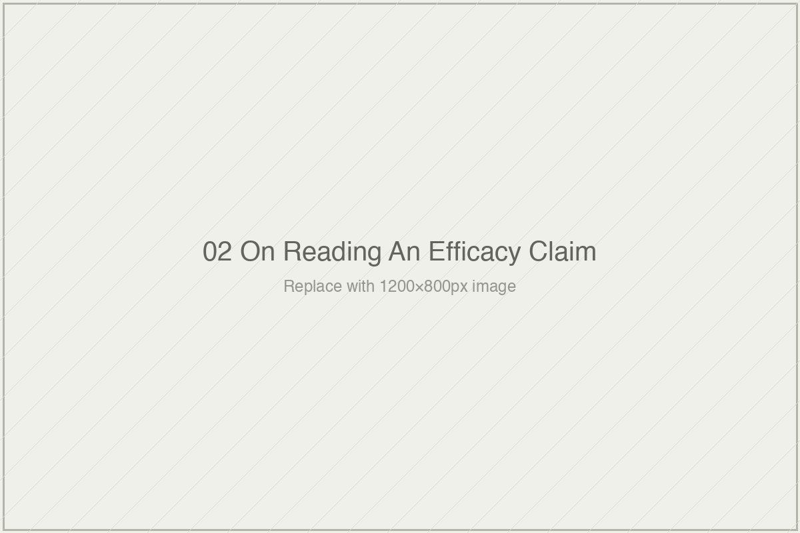

# On Reading an Efficacy Claim

*Essai 2*

---

Here is a sentence.

*Students who used Khan Academy's MAP Accelerator at the recommended level achieved math growth scores that were 0.26 standard deviations higher than those of the comparison group.*

This sentence comes from a paper titled *Estimating the Causal Effects of Khan Academy MAP Accelerator Across Demographic Subgroups*, authored by Phillip Grimaldi, Kodi Weatherholtz, and Kelli Millwood Hill of Khan Academy. It was presented at the 15th International Conference on Educational Data Mining in Durham, United Kingdom, in July 2022. The study population was substantial: 180,307 students and 5,818 teachers across 99 school districts during the 2020-2021 academic year. The outcome measure was the NWEA MAP Growth assessment, a computerized adaptive test widely used for accountability purposes across American schools. The finding has been cited by Khan Academy in its marketing, by the Bill & Melinda Gates Foundation in its tutoring advocacy, and by federal education databases that register the study as providing "Moderate Evidence" of effectiveness under the Every Student Succeeds Act.

A 0.26-sigma effect is, by any contemporary standard in education research, a respectable finding. Matthew Kraft's 2020 analysis of 747 randomized controlled trials in education found the median effect size to be about 0.10 sigma. Khan Academy's number is more than twice that median. In Kraft's revised benchmarks for field-based education research — where he classifies effects above 0.20 as "Large" — the 0.26 number sits comfortably above the threshold. Taken at face value, this is evidence that Khan Academy's platform helps students learn mathematics.

Hold this sentence for a moment before the essai goes any further. Notice that it sounds credible. It is credible. The authors are serious researchers. The sample size is large. The statistical methods are appropriate for the study design. The finding is not inflated beyond what the data support. This is not a fraudulent study or a sloppy one. It is, by the conventions of the field in which it was produced, a competent piece of work.

And yet.

In the Fall 2024 issue of *Education Next*, a senior advisor at the XQ Institute named Laurence Holt published a short analysis of this study and a handful of others like it. He titled the piece *The 5 Percent Problem: Online mathematics programs may benefit most the kids who need it least*. Holt's argument was specific and, once you have read it, difficult to un-see. The 0.26-sigma effect Khan Academy reports is real, but it is the effect on students who used the platform at the "recommended" level — defined in the study as 30 or more minutes per week. How many students in the 180,307-person sample actually met that threshold?

Approximately 4.7%.

The remaining 95.3% of students in the study — about 172,000 of the 180,307 — did not reach the usage level required to see the reported effect. The headline finding, in other words, is a finding about the roughly 8,500 students who used the platform the way the researchers recommended, not about the 180,000 students who received access to the platform. The study's design explicitly excluded the 95% from the comparison that produced the 0.26 number.

Holt put this in plain terms. *"Imagine a doctor prescribing a sophisticated new drug to 100 patients and finding 95 of them didn't take it as prescribed. That is the situation with many online math interventions. They are a solution for the 5 percent."*

This is where the essai begins.

I am going to walk you through this finding carefully. Not to adjudicate whether Khan Academy works or does not work. That is not what the essai is asking. I am walking through it because the 0.26-sigma number, and the way it travels in the world, is an excellent specimen of the kind of claim you will encounter routinely across the rest of this volume, and the rest of your life in this field. The claim is real. The researchers are honest. The analysis is methodologically competent. And yet something is happening, between the analysis and the citation, that the reader of the citation is not being told.

The apparatus this essai will build is the set of questions you can ask of any such claim to see what the citation does not tell you. Not five abstract principles. Five concrete questions, arising from what we are about to do with the Khan Academy study, which you will then carry with you into every efficacy claim the rest of the volume examines — and every efficacy claim you encounter after this book is closed.

---

Begin with the first question. *What was measured, specifically?*

The MAP Growth assessment used as the outcome measure in the Khan Academy study is not a neutral test. It is a computerized adaptive test developed by NWEA, a nonprofit assessment organization whose products are used in many American school districts for benchmarking and accountability. The MAP Growth mathematics assessment covers a specific curriculum — the skills that American K-8 mathematics curricula are designed to teach, organized around standards and sequenced by grade level. The test is good at what it does. It measures, with psychometric rigor, how well students can perform on items drawn from the curriculum American schools teach.

Now consider what the intervention was. Khan Academy's MAP Accelerator, as the study's own documentation describes it, is "a personalized, web-based mathematics mastery learning tool developed in partnership with NWEA." The platform was built, explicitly, to support the same skills that the MAP Growth assessment measures. This is not a hidden fact or a methodological trick. Khan Academy says so openly, and the partnership with NWEA is part of the product's value proposition. The platform is designed to prepare students for the MAP Growth test. The study measured student performance on the MAP Growth test.

This is not a scandal. Education researchers have a term for this: *alignment*. When an intervention is designed to teach specific skills and is evaluated on a test of those same skills, the intervention and the outcome measure are aligned. Aligned interventions, evaluated on aligned measures, reliably produce larger effect sizes than the same interventions evaluated on less-aligned measures. This is a well-documented pattern in the education research literature, and it is the first concrete question the apparatus teaches you to ask.

*What was measured, and what was the measurement aligned to?*

The Khan Academy finding is an effect on a test aligned to the curriculum the platform was built to teach. This is a specific thing. It is evidence about performance on aligned items. It may also be evidence about something broader — about mathematical understanding, about learning, about whatever the construct is that the study's framing invokes. But the evidence for the broader construct requires additional work to establish. The alignment between intervention and outcome measure is the first thing the apparatus surfaces, and it is the first specification you carry forward into the rest of your reading.

---

Second question. *What was the baseline?*

Every effect size is a difference. A 0.26-sigma effect is not "this intervention produces learning"; it is "students receiving this intervention performed 0.26 standard deviations higher than some comparison group performed." The comparison group defines what the effect is an effect against. Change the comparison group, and the effect changes — sometimes dramatically, sometimes in ways that reveal the intervention is doing more or less than the headline suggests.

The Khan Academy 2022 study used a specific comparison. Students categorized as "recommended usage" — 30 or more minutes per week on the platform — were compared to students categorized as "comparison" — less than 15 minutes per week on the platform. Both groups had access to Khan Academy. Both were enrolled in the same schools and districts. Both took the same MAP Growth assessment. The difference between them was not whether they had the platform but how much they used it.

This matters because the comparison is doing something specific. The study is not comparing Khan Academy users to students who received no similar intervention. It is not comparing Khan Academy users to students in a district that never adopted the platform. It is not comparing Khan Academy to a different intervention — a workbook, a tutor, a different platform — at comparable cost. The comparison is, in effect, *students who used the platform a lot versus students who used the platform a little*.

An effect of this kind is evidence for something real: that engagement with this platform, at sufficient dosage, is associated with measurable performance gains on an aligned test. It is not evidence for several other things that the citation apparatus often conflates with it. It is not evidence that providing the platform to a school produces gains, on average, across that school's students. It is not evidence that the platform is more effective than alternative interventions. It is not evidence about what happens to students who receive the platform but do not engage with it intensively.

The authors of the study do not claim any of these additional things. The apparatus of citation, which is a different apparatus from the apparatus of research, frequently acts as though they had.

*What was the baseline, and is this comparison the comparison I thought it was?*

---

Third question. *What population is this a finding about?*

Holt's "5 Percent Problem" is, at its core, a population question. The study's headline compares about 8,500 students who used the platform at the recommended level to a comparison group that also drew from the same 180,000-student pool. What happened to the other ~172,000 students — the ones who received access to the platform but did not meet the 30-minute threshold — is absent from the headline. The effect size is an effect on the high-usage subset, not on the full study population.

The authors of the study acknowledge this, if you read carefully. The analytical decision to compare high-usage students to low-usage students is transparent in the methodology. It is not hidden. But the framing of the finding in downstream citation often treats the 0.26-sigma figure as though it described what Khan Academy does, in general, when deployed to schools. It does not describe that. It describes what Khan Academy does to the subset of students who use it as recommended, compared to students in the same schools who did not.

This matters because the selection into high usage is not random. Students who reach 30 minutes per week on a mathematics practice platform are a non-random subset of the student population. They are students who — for reasons that include motivation, access to time and devices outside of school, home environments that support sustained independent work, and probably dozens of factors the study does not measure — engage with the platform intensively when it is available. The platform's effect on *these* students is what the 0.26 number reports. Whether the platform would have the same effect on the other 95%, if they could be induced to use it at the same level, is a different question. The study does not answer it. It is not designed to.

Holt's medical analogy is useful here. A drug study that reports strong effects on the patients who actually took the drug — while 95% of the prescribed patients did not — is not a refutation that the drug works. It is a specific and narrower claim than the drug marketing implies. The drug works for those who take it. Whether it is a viable public-health intervention depends on how many will take it, and on whether the ones who do are systematically different from the ones who don't. Those are separate questions, and the drug study does not settle them.

The same logic applies to learning systems. Khan Academy's MAP Accelerator may well produce 0.26-sigma gains for students who engage with it at the recommended level. Whether this makes it a viable intervention for the populations Khan Academy markets to — particularly, the "historically under-resourced groups" the study foregrounds — depends on who in those populations actually engages at the recommended level, and on whether the 95% who do not engage are losing something the 5% who do are gaining. The study does not answer these questions. Citing the 0.26 number in contexts where they matter does work the study does not authorize.

*What population is this a finding about, and how does this population relate to the population the finding is cited as informing?*

---

Fourth question. *What was the timescale, and would the finding survive a durability test?*

The Khan Academy study assessed outcomes in the spring of 2021, using a baseline from the fall of 2020. The measurement window was one academic year. This is a longer timescale than many EdTech efficacy studies use — some measure outcomes within weeks of the intervention — but it is still a relatively short window for claims about learning.

Here is why this matters. There is a distinction in the experimental psychology literature, developed across several decades by Robert Bjork and others, between *performance* and *learning*. Performance is what a student can demonstrate at a specific moment. Learning is what persists. The two are empirically dissociable. Conditions that boost performance in the short term — massed practice, blocked scheduling, familiar testing contexts — often fail to build the durable storage that supports performance months or years later. Conditions that depress short-term performance — spaced practice, interleaved content, retrieval under difficulty — often produce the opposite pattern, with weaker immediate gains but stronger long-term retention.

Bjork's distinction is not a fringe finding. It is a foundational result in the learning sciences literature, reported consistently across many studies, and it is the basis for essentially every evidence-based recommendation for effective practice: spaced repetition, retrieval practice, desirable difficulty. Any claim about learning, as opposed to a claim about immediate performance, requires durability evidence. A test administered at the end of the intervention year, on content the intervention was designed to teach, measures performance under conditions that maximize retrieval strength. What storage strength remains three months later, or a year later, or upon entry to a more advanced course, is a separate question requiring separate measurement.

The Khan Academy study does not provide durability data. It is not designed to. The MAP Growth measurement windows used are aligned to school-year accountability cycles, which is the measurement cadence the product was built to serve. Whether the 0.26-sigma gains remain detectable at the start of the next academic year, or predict performance on subsequent-year MAP Growth tests, is not in the study. It might be addressable through Khan Academy's internal longitudinal data. But that evidence — if it exists — is not part of the finding as published.

This is not a criticism of the study. It is a description of what the study measured and what it did not. The 0.26-sigma finding is an effect on aligned performance at the end of one academic year. Whether it is also an effect on learning, in the fuller sense of durable transferable understanding, is a separate empirical question that the study does not address and that the citation apparatus often treats as settled.

*What was the timescale, and what kind of claim does a finding at this timescale support?*

---

Fifth question. *What was the cost, and against what?*

Cost almost never appears in the headline reporting of EdTech efficacy studies. It is treated, by convention, as a separate concern. A business question. A procurement question. Something for purchasing departments rather than for research.

This separation, I will argue across several essais in this volume, is itself a move with epistemic consequences. For now, at the level of the apparatus, the question is simple: *what does this effect cost to produce?*

Khan Academy Districts, the institutional product referenced in the 2022 study, is priced at approximately $10 per student per year. This is, by the standards of educational interventions, remarkably low. A high-quality 1:1 tutoring program — the kind of program that produced Bloom's 2-sigma finding in 1984, which we will examine in the next essai — costs on the order of $2,000 to $4,000 per student per year in contemporary dollars. Modern research-validated tutoring programs, Saga Education and MATCH Corps among them, operate in this range. The cost ratio between high-quality human tutoring and Khan Academy's platform is approximately 200-to-1 to 400-to-1.

This matters for how the 0.26-sigma effect should be read. A 0.26-sigma effect produced at $10 per student per year is not the same finding as a 2.0-sigma effect produced at $2,000 per student per year. They are findings about different interventions under radically different cost structures. Placing them on the same axis — treating both as interventions the field could "choose between" — obscures what each is evidence for. The high-quality tutor costs more because the tutor is producing more. The platform costs less because the platform is producing less. This is not a criticism of the platform. It is a description of what a 200-to-400x cost ratio implies about comparability.

I will develop this point at length in a later essai. For now, the apparatus requires you to hold cost as a first-class analytical variable, not as a separate business concern. An effect size without its cost denominator is a number that is difficult to interpret. Two effect sizes from interventions at different costs are not two points on a single axis.

*What did this cost to produce, and what does the effect mean at this cost?*

---

Five questions. Outcome measure. Baseline. Population. Timescale. Cost.

If you ask these five questions of the Khan Academy finding, here is what the 0.26-sigma number is evidence for:

*This platform, aligned to the assessment used to measure it, used at the recommended dosage for an academic year, produces observed performance gains of about 0.26 standard deviations on students who engage with it at that dosage, at a cost of approximately $10 per student per year. Students who do not engage at the recommended dosage — approximately 95% of students provided access — do not appear in the headline comparison.*

This is a much narrower and more specific claim than the one that circulates. It is also, I want to emphasize, not a refutation of the study. The study's authors did not claim more than this. What they claimed is exactly what the number supports. The gap between the 0.26-sigma number as a research finding and the 0.26-sigma number as a cited benchmark is not the authors' fault. It is what happens to findings when they leave the research context and enter the citation apparatus. The apparatus of research is one thing. The apparatus of citation is another.

The apparatus this essai has built is not a refutation procedure. It is a reading procedure. When you ask the five questions of a claim, you do not end up with a verdict about whether the claim is true or false. You end up with a more specific claim than the one you started with — a claim that describes what the original finding actually supports, as distinct from what the finding is being asked to support in the context where you encountered it.

This distinction matters. It matters for the rest of this volume, because every essai that follows will apply these same five questions to other findings, and the cumulative pattern — what the findings actually support, compared with what they are cited as supporting — is the subject of the book. But it matters more, I think, for what you carry out of the book afterward. The next time you encounter an efficacy claim about a learning system — in a conference talk, a foundation announcement, an investor deck, a journalism piece, a Slack thread — you can ask these five questions. You do not need the study to have been flagged as suspect. You do not need to be an expert in the platform or the population. You need only to ask what the claim actually supports, and then to compare that to what the claim is being cited to support in the context where you encountered it. The gap between those two things is where the apparatus of the field does its work.

---

There is one more move I need to name before this essai closes.

Throughout the five questions, I have been pointing at something that does not quite have a name in most casual discussions of efficacy research. I want to give it a name now, because this is the concept the rest of the volume depends on.

Every efficacy claim involves three things: a measurement, a construct, and an asserted relationship between them. The measurement is what the researchers actually did — the test administered, the scores computed, the conditions compared. The construct is what the measurement is meant to be evidence for — *learning*, *mastery*, *effectiveness*, *understanding*, whatever category the claim invokes. The asserted relationship is the claim that the measurement indexes the construct adequately to license the uses the claim is put to.

The apparatus of the five questions surfaces, in each of its moves, some aspect of this three-part structure. The outcome-measure question asks what the measurement is, specifically. The baseline question asks what the measurement is measured against. The population question asks who the measurement is a measurement of. The timescale question asks over what time the measurement is valid. The cost question asks what resources were required to produce the measurement.

What all five questions are circling is the relationship between the measurement and the construct. The 0.26-sigma number is a specific measurement under specific conditions. What it is claimed as evidence for — that Khan Academy works, that the platform helps students learn mathematics, that adaptive learning is effective — are constructs the measurement may index, may partially index, or may not index at all, depending on specifics the five questions surface.

The distinction between what is measured and what that measurement is a proxy for is the central analytical tool of this volume. I will return to it across every essai. In the thirteenth essai, which is the book's deepest examination of the apparatus we are beginning here to build, I will argue that the gap between measurement and construct is the single most important observation the book makes. For now, in this essai, I am naming it so you have the vocabulary to carry forward.

A measurement is not a construct. The measurement is evidence for the construct only to the degree that the relationship between them has been established. Across most of the efficacy claims this volume examines — and, I will argue, across most of the efficacy claims the learning-systems field has produced across six decades — the relationship between measurement and construct has been assumed rather than established. That assumption is the thing the apparatus asks you to notice.

---

Here is what I want you to do with this essai.

This coming week, you will encounter an efficacy claim about a learning system. It may arrive in an article, a pitch deck, a journalism piece, a Slack discussion, a conference talk. It may be about Khan Academy, or about a competitor, or about something adjacent — a tutoring program, a curriculum intervention, a reading platform, an AI tool. When it arrives, try to hold it before you respond to it. Not for long; just for a moment. And ask the five questions.

What was measured, and was the measurement aligned to the intervention?
What was the baseline, and is the comparison the comparison I thought it was?
What population is this a finding about, and how does that population relate to the population the finding is being cited as informing?
What was the timescale, and what kind of claim does a finding at this timescale support?
What did this cost to produce, and what does the effect mean at this cost?

You may not be able to answer every question from the information in front of you. That itself is information. When a claim is circulated in a form that makes the five questions unanswerable, the gap between the claim and what the claim can support is probably large. Claims that can survive the five questions tend to be specific. Claims that cannot tend to be sweeping.

Then, once you have held the five questions against the claim, notice the gap between what the finding supports and what the finding is being cited as supporting in the context where you encountered it. That gap is where the apparatus of the field does its work. It is, I am arguing, where the apparatus of the field has been doing its work for six decades. The next essai will show how old this pattern is, and the essais after that will show how consistently it has reproduced itself across every generation of learning technology since the teaching machines of the 1950s.

The apparatus you now have is portable. You can carry it into every reading you do across the rest of this book. You can carry it into the next Tuesday morning when someone emails you a new efficacy study and asks what you think. You can carry it into the next funding meeting where a sigma number is invoked at you. You do not need me to tell you what to make of any specific claim. You make of it what the five questions reveal.

That is what this essai was for.

The next essai takes the apparatus we have just built and points it at history. The measurement habits the five questions are surfacing are not new. They were not invented in 2022 by Khan Academy, or in 2024 by Harvard physics researchers, or in the current AI moment by any specific company. They were inherited, with remarkably little revision, from research conducted in the 1950s on pigeons pecking keys in Skinner's laboratory — research that established the measurement apparatus the field still uses, several generations of technology later. If the problem the first essai named is real, and the apparatus the second essai has built is sound, then the next essai will show that both are older than most of the technologies this book examines. The third essai begins there.

---

### What I am not sure about, and what I am asking from you

This essai is load-bearing for the volume. If the apparatus does not land here, the essais that follow cannot do the work they are meant to do. I want to name specifically what I am unsure about in how I have built it.

I am not sure I have been entirely fair to the Khan Academy 2022 study. The authors of that study, Grimaldi, Weatherholtz, and Hill, did careful methodological work, acknowledged the quasi-experimental nature of their design, and framed their findings in scope-appropriate ways in the paper itself. The gap I have described — between what the finding supports and what the finding is cited as supporting — is not their gap. It is a gap that emerges when the finding enters the citation apparatus of the field. A reader might reasonably ask whether I have been too quick to use a specific study as a case when the problem I am examining is larger than the study. The response is that I have tried to name, throughout, that the authors did not claim more than their finding supports. If the essai still reads as though I am criticizing the authors rather than the apparatus, it has drifted. Tell me where.

I am not sure the five questions are the right five, or the right number. They are the questions that, when applied to the Khan Academy study, surface the specific incommensurabilities I wanted you to see. Other efficacy claims might be better read through slightly different questions — about randomization, about statistical power, about pre-registration, about fidelity of implementation. A reader more expert in specific methodological traditions than I am might reasonably propose alternative apparatuses. I have chosen these five because they are the ones that recur across the cases this volume examines. But the apparatus is not sacred. It is an attempt at a useful reading tool, not a complete methodological framework.

I am not sure I have done enough with Laurence Holt's analysis. Holt's "5 Percent Problem" framing is sharp, well-sourced, and does analytical work this essai has borrowed from. A fuller treatment of Holt — the studies he examines beyond Khan Academy, the pattern he documents across multiple platforms, the response (or lack thereof) from the organizations whose studies he critiques — would be its own essai. I have used Holt as a case here, which reduces his analysis to a single illustration. A reader who finds Holt's piece indispensable and thinks it deserves more than I have given it here should push on that. I am inclined to agree.

Finally, I am not sure the apparatus I have built here is enough to carry the rest of the book. It is a reading tool, not a complete framework for evaluating learning-systems research. The essais that follow will add to it — cost as an epistemic variable receives its own essai; the measure-vs-construct distinction receives its own essai; the patterns the field displays when tools underperform receive their own essai. The apparatus grows across the volume. What I have installed here is the foundation. Whether it bears the weight of what follows will become clear, essai by essai.

The comments on this essai's Substack page are the simplest place to tell me where this apparatus falls short. In the quarterly Kindle compilation, where I incorporate the series' discussion into the record, any pushback from this essai will be visible — in marginal corrections, in footnote commentary, in whatever form the responses call for. If the apparatus fails for you, the entire book may fail. I want to know before the later essais depend on it.

The next essai examines how old the problem the apparatus surfaces actually is. I hope you will continue with me.

---

*[End of Essai 2. Projected page count at trade-scholarly typesetting: 26–28 pages. Word count: approximately 6,200.]*

**Tags:** Khan Academy MAP Accelerator, efficacy research reading apparatus, effect size interpretation, measurement versus construct, Laurence Holt 5 percent problem