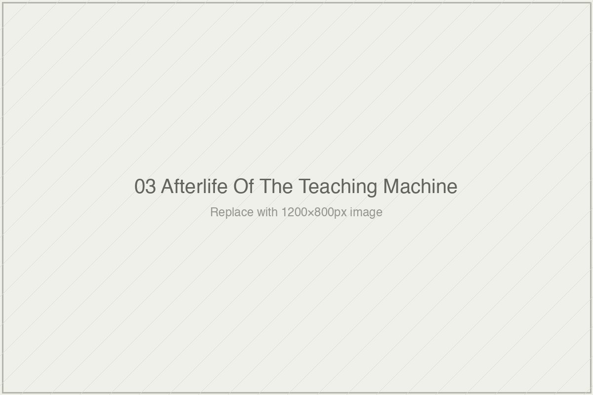

# On the Afterlife of the Teaching Machine

*Essai 3*

---

## What the Apparatus Was Built to See

---

A district superintendent somewhere in the United States is reading a vendor's white paper this week. The paper reports a 0.7 sigma gain on a post-test after a brief intervention. It describes the intervention in glowing prose. It does not report what students could do with the material six months later, because it did not test that. It does not report per-student cost against comparable alternatives, because it did not calculate that. It compares against a minimal baseline, because that is the comparison that was available. The superintendent does not know that the specific shape of this evidence — what was measured, what was excluded, over what timescale, against what baseline — was laid down in 1958 by a man named Burrhus Frederic Skinner, sitting in a room in Pittsburgh watching his daughter's fourth-grade arithmetic class. The superintendent will cite the white paper to a school board. The school board will authorize the purchase. Students will use the tool. Whether they learn anything durable from it will not be established, because the apparatus of evidence is not engineered to establish that.

This is the world the third essai of *[book]* describes. Its claim is uncomfortable and, once made, difficult to unsee: the measurement apparatus of educational technology efficacy research — what counts as demonstrating that a learning tool works — has been inherited, largely unexamined, across six decades and four waves of technological change. Skinner designed a teaching machine in 1958 that recorded accuracy per frame, response time, progression, error pattern. He built this because his behavioral science said these were the relevant things to record. The teaching machine is long dead. Its apparatus of evidence is alive, operating, and shaping what a 2021 peer-reviewed Duolingo study counts as demonstrating that Duolingo works. Skinner's theoretical framework has been largely abandoned. His measurements have not been.

I find this essai's central move unusual enough to name plainly. Most methodological critiques of EdTech efficacy research treat "good measurement" as a known quantity and ask whether a given study meets it. This essai asks a different and more consequential question: what if the standard itself is historical? What if what counts as evidence in this field is not neutral but theory-laden — a specific inheritance from a specific moment that has persisted long past the moment of its justification? The essai does not argue that Skinner was wrong or that contemporary researchers are careless. It argues that the apparatus has been inherited rather than revised, and that the inheritance has consequences the field has not reckoned with. This is a harder argument than the usual one, and it is more productive.

---

The essai's method is to follow the apparatus through its hosts. Skinner's teaching machine in 1958. Patrick Suppes's computer-assisted instruction at Stanford in the 1960s. John Anderson and Kenneth Koedinger's Cognitive Tutor at Carnegie Mellon in the 1990s. The commercial adaptive-learning platforms of the 2010s — Knewton, DreamBox, i-Ready, ALEKS. The current AI-tutor wave — Khanmigo, Kestin, Eedi, Rori. At each stop, the essai documents what the system measures and what it does not. At each stop, the pattern holds. The technology becomes incomprehensibly more sophisticated; the shape of what counts as evidence remains essentially Skinnerian. Aligned outcome measure. Short timescale between intervention and assessment. Selection of successful users as the study population. Comparison to historical or minimal baselines. No cost denominator.

The author is careful to distinguish the apparatus from the researchers who operate it. Anderson and his Cognitive Tutor collaborators were, the essai notes, remarkably transparent in their 1995 paper about transfer limits — acknowledging that their students demonstrated transfer "to the degree that they can map the tutor environment into the test environment." This is an honest acknowledgment that the tutor's measured effectiveness does not necessarily generalize to contexts structurally different from the tutor itself. Suppes's 1966 paper in *Scientific American* is similarly precise about what its measurements encompass. The DreamBox efficacy researchers at Harvard's Center for Education Policy Research noted openly that usage correlations may partly reflect student motivation rather than platform contribution. The critique is not that the researchers were dishonest. The critique is that their caveats, stated plainly in primary papers, have been progressively stripped as their findings traveled through citation chains, meta-analyses, vendor marketing, and school-district procurement decisions. The apparatus inherits the measurement choices. It does not inherit the methodological humility. This may be the essai's most important observation, and I want to develop it further than the essai itself does, because the moral weight of the argument lives here.

---

Consider what happens to a finding as it moves through the institutional machinery of EdTech.

At the primary-research stage, a paper like Anderson 1995 is often careful. The authors specify what their system does and does not demonstrate. They identify limits. They publish acknowledgments alongside effect sizes. This is the paper as it exists in the *Journal of the Learning Sciences*, read by other researchers who have the methodological vocabulary to interpret the caveats correctly.

At the citation stage, something begins to happen. A subsequent paper cites Anderson 1995 for its effect size — say, the claim that Cognitive Tutor produces substantial gains on aligned post-tests. The transfer caveat may or may not survive the citation. Often it does not. The citing paper needs a number, and the number is available, and the theoretical framework surrounding the number is more than the citing paper has space for. The apparatus has now translated a careful finding into a portable data point.

At the meta-analytic stage, the portable data point joins other portable data points. Effect sizes across studies get aggregated. The heterogeneity of measurement choices across the component studies — what each one measured, at what timescale, against what baseline — gets smoothed by the aggregation. A meta-analysis reports an average effect across the literature. The average has the authority of statistics and the opacity of a summary. What the individual studies did and did not establish becomes progressively invisible.

At the vendor-marketing stage, the meta-analytic finding gets translated again. A product's efficacy claim now rests on "research showing" that this class of intervention produces substantial gains. The claim is technically defensible — there is research showing it — while being substantively misleading about what that research actually established under what conditions. The translation has moved from "our system produced this accuracy rate on these aligned items at immediate timescale under these conditions" to "research shows our system works."

At the procurement stage, a district superintendent reads the vendor's claim alongside the vendor's case studies and the vendor's references to peer-reviewed research. The superintendent has no reason to recover the caveats that were stripped three translations ago. The district buys the product. The students use it. Whether they learn anything that persists is not measured by anyone with institutional reason to measure it.

This is the pipeline the essai names but does not fully trace. The apparatus is not only a measurement convention in research papers. It is a translation machine — one that converts theoretically modest findings, under specific conditions, into broadly promotional claims. The researchers can be honest. The apparatus launders the honesty out. This is how a 1995 paper whose authors wrote plainly about the limits of aligned-outcome transfer ends up, three decades later, underwriting vendor claims about "research-based" AI tutoring that make no reference to those limits at all.

What the essai's careful treatment of Anderson, Suppes, and the DreamBox researchers does — by specifically crediting their methodological honesty — is make visible how much of that honesty the surrounding institutional structure fails to carry forward. The researchers were honest. The apparatus was not designed to remain honest once it left them. This is not a problem that can be solved by asking researchers to be more careful, because the researchers already were careful. The problem lives downstream, in the machinery that receives what the researchers produced and does something else with it. The apparatus is not just what happens in the study. It is what happens to the study.

---

The essai's demonstration piece — its application of the apparatus to Jiang et al. 2021's Duolingo study — is where the theoretical argument becomes readable. The study reports that Duolingo learners who completed the beginning-level (A2) courses achieved ACTFL Intermediate Low proficiency in reading and Novice High in listening on the external STAMP 4S assessment, levels the paper characterizes as comparable to university students finishing four semesters of college-level language study. The finding has been cited in Duolingo's marketing materials. It is the kind of evidence that lands in vendor white papers and, eventually, in superintendents' in-boxes.

The essai walks through what the apparatus illuminates about this study. The outcome measure was external — a real methodological improvement over purely internal assessments — but restricted to reading and listening, the specific modalities Duolingo's interface is engineered to build. Speaking and writing were excluded. The post-test was immediate; there was no three-month, six-month, or one-year delayed assessment. The population was restricted to learners who had *completed* the course, filtering out the majority of Duolingo users who do not. The comparison to four semesters of college was historical rather than contemporaneous. No cost denominator — no accounting for the hundreds of hours Duolingo completers typically invest — was reported. Four of the five authors were Duolingo employees at the time of publication.

None of this makes the study fraudulent. The authors are transparent about their selection criteria, their affiliations, their outcome measures. The paper is methodologically careful within its own terms. What the essai's apparatus reveals is that the specific terms it was careful within are Skinner's terms. The study measures what the teaching machine was engineered to measure. It does not measure what the teaching machine was not engineered to measure. Six decades and four technology waves later, the apparatus is intact, and its characteristic silences — durability, transfer, opportunity cost — are the silences Skinner's framework specifically did not require him to address.

---

Where the essai is strongest is in the discipline of applying the same questions to Jiang 2021 that it has applied to Skinner, Suppes, Anderson, and DreamBox. The author does not select a study whose findings are politically unsympathetic in order to make the apparatus legible. Jiang 2021 is a paper whose framing — free app as effective as paid college course — is congenial to much of the education-reform establishment, cited in service of claims about technology's democratizing potential. The essai applies the apparatus to it anyway, and what emerges is not a polemic but a methodological observation: the study's measurement choices, line by line, are traceable to an inheritance the study does not name. This is what makes the analysis land. It is the same analysis the essai would apply to any study in the tradition. Whether the finding is palatable or uncomfortable is not the variable.

Where the essai acknowledges its own limits is in the closing section, which is itself an unusual formal choice. Most scholarly essais do not end with a litany of "I am not sure." This one does, and the choice is instructive. The author is not sure the treatment of Skinner is fair. Not sure the Suppes and Anderson passages give their traditions full due. Not sure the Jiang 2021 analysis would withstand a reader's charge of selective rigor. Not sure the inheritance claim is sufficiently tentative, given that six decades compressed into one essai will miss nuance a specialist would preserve. These acknowledgments function differently than the methodological caveats in Anderson 1995. Those caveats lived in a single paper and were progressively stripped as they traveled. These acknowledgments live at the end of a essai that is arguing against precisely that stripping. The form enacts what the argument demands: a refusal to let the caveats be subordinated to the finding.

---

What the reader carries forward from this essai is not an attack on specific educational technologies. It is a portable tool — the apparatus's characteristic questions, applied to any efficacy claim that crosses their path. What did the outcome measure, and was it aligned with what the intervention taught? Over what timescale from intervention to assessment? Against what baseline? With what population selection? At what cost? The questions are simple. The discipline is in asking them consistently, of studies whose findings feel congenial and studies whose findings do not, of products marketed to underserved communities and products marketed to well-resourced ones, of AI tutors and of the interventions they are claimed to improve upon.

The superintendent reading the vendor's white paper this week will not be asked these questions by anyone institutionally positioned to make them stick. That is the consequence of sixty years of apparatus inheritance. The apparatus has become the field's common sense. What this essai does is make the common sense legible as a choice — a specific theoretical commitment laid down at a specific moment by a specific researcher whose framework has otherwise been abandoned. The measurements persisted. The claims they support travel further than the measurements warrant. Students learn, or do not learn, under tools whose efficacy has been established by an apparatus that was not engineered to establish whether they learn.

This is the book's subject. The essai is its foundation. Whatever the book's subsequent essais establish about Bloom's 2-sigma, about meta-analytic aggregation, about the current AI-tutor wave, they establish under the apparatus this essai has just named. Naming it is not the end of the argument. It is the condition for having the argument at all.

---

**Tags:** educational technology efficacy research, B.F. Skinner teaching machine, measurement apparatus inheritance, Duolingo ACTFL outcomes study, learning sciences methodology critique