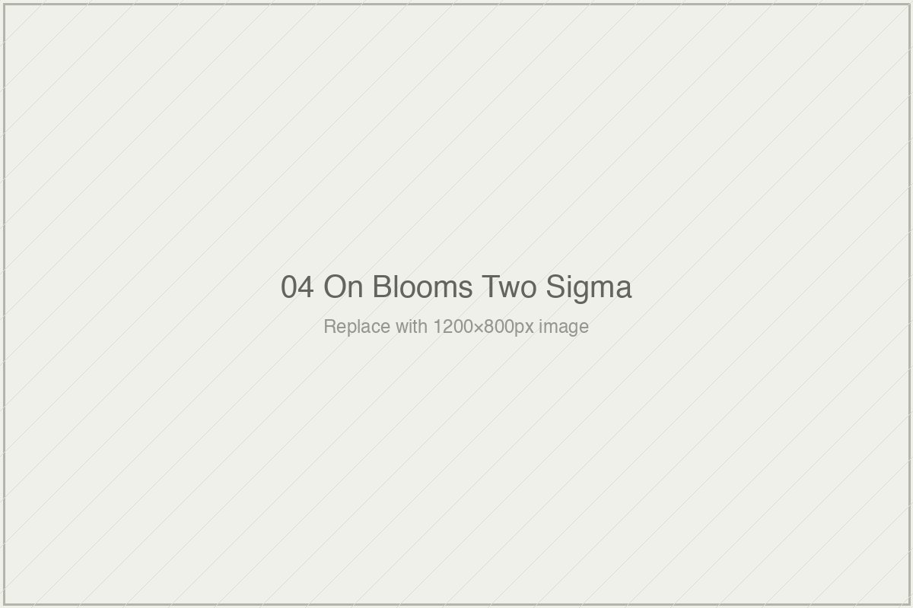

# On Bloom's Two Sigma

*Essai 4*

---

## What the Number Was Asked to Do

---

Numbers circulate. Some of them die quietly in the journals that produced them, cited a few times, forgotten. Some of them take on second lives beyond the conditions of their original measurement, acquiring rhetorical weight that has nothing to do with what they once measured. The 2.0 sigma figure that Benjamin Bloom reported in a seventeen-page paper in *Educational Researcher* in 1984 is the most successful example of the second kind that the learning-systems field has ever produced. Forty years after its publication, it is the single most-cited number in educational technology discourse. It is invoked from the TED stage, in foundation white papers, in McKinsey decks, in venture pitches, in the acknowledgment sections of AI-tutor demonstrations. It has become, the fourth essai of this volume argues, less a measurement than a shibboleth — a word used to signal membership in a discourse rather than to index any specific finding about the world.

The essai's project is to rescue Bloom's paper from the uses it has been put to, which is a more delicate operation than it sounds. The essai is not claiming that Bloom was wrong. It is not claiming that the Anania and Burke dissertations Bloom supervised produced inflated findings or that the 2.0 sigma effect was an artifact. The 1984 paper is careful, internally consistent, and explicit about its conditions. What the essai is claiming is that the number has traveled very far from those conditions, and that the contemporary rhetorical use of "2-sigma" bears only a tenuous relationship to what Bloom actually measured and what he actually proposed as its implication. The paper's title is *The 2 Sigma Problem* — the word *problem* is doing work that subsequent citation has systematically erased. Bloom was naming a gap, acknowledging that the conditions which produced the gap were "too costly for most societies to bear on a large scale," and calling for research into scalable group-instruction methods that might approach tutoring's effectiveness without tutoring's cost. The call was specific. The response the field has offered — projects that invoke the number while departing from Bloom's proposed remedy — is specific too, in a different way.

I want to credit what this essai does before I push on what it leaves to be done.

---

The essai's structure is disciplined. It examines four dimensions of the 2-sigma finding in turn, and the examination is fair to Bloom throughout. The original studies were specific experiments with specific conditions: fourth, fifth, and eighth graders studying probability and cartography — subjects chosen deliberately to minimize prior-knowledge confounds — over three-week windows, with undergraduate tutors who received approximately one week of training. The "expert human tutor" who populates contemporary AI-tutor rhetoric, as the essai notes, was not the original benchmark. The tutoring condition was not tutoring alone but tutoring combined with mastery learning, which means the 2.0 sigma figure is the joint effect of two interventions operating together. The assessments were researcher-designed tests aligned to what the instructional units had taught — a measurement choice that, as the second essai of this volume established, systematically produces larger effect sizes than distal measures.

The replication record across the subsequent four decades tells its own story. The essai lays out the central tendency honestly: Peter Cohen's 1982 meta-analysis at 0.33 sigma; Kurt VanLehn's 2011 meta-analysis at 0.76 to 0.79 sigma; Nickow, Oreopoulos, and Quan's 2020 systematic review at 0.37 sigma. No finding in the subsequent four decades has reliably reproduced Bloom's 2.0 figure. This is not, the essai is careful to note, evidence that Bloom was wrong — the conditions that produced 2-sigma in Anania and Burke's original studies have rarely been reproduced, which is a different claim. But it does establish that the number circulates as a benchmark while sitting, empirically, well above the distribution of results that has followed in its wake.

The cost-structure dimension is where the essai sharpens. Bloom's original studies required one-to-one or one-to-three tutoring ratios sustained over three weeks. The contemporary equivalent — research-validated high-dosage tutoring programs like Saga Education — runs at approximately 3,500 to 4,800 dollars per student per school year. The AI-tutor systems currently being evaluated against Bloom's benchmark operate at 5 to 10 dollars per student per year. The essai draws the implication precisely: a ten-dollar platform producing 0.26 sigma and a four-thousand-dollar tutoring program producing 0.37 sigma are "not on the same axis." They are answering different questions at different price points. The invocation of Bloom's 2.0 figure to justify the first kind of intervention borrows the benchmark without the benchmark's cost conditions. This is a specific critique, carefully stated.

What I want to develop further is the fourth dimension of the essai's treatment — the one that, for all the essai's care, lands with the most weight and bears the most moral charge.

---

Bloom's 1984 paper was not proposing tutoring as the answer. This is the observation the essai makes that I find most consequential, and that contemporary invocation most systematically erases.

What Bloom was proposing — read carefully, in the paper's own words — was research into methods of *group* instruction that might approach tutoring's effectiveness without tutoring's cost. The framing was explicit. He cataloged "alterable variables" that teachers could combine in classroom settings. He emphasized that the goal was to free teachers from administrative work so that they could focus on "diagnosing misunderstanding" and "motivating and rewarding achievement." He wrote, in a sentence that the essai correctly flags as having been largely ignored by his subsequent citers, that in this vision "the teacher is more important than ever." Technology, in Bloom's original framing, was not a replacement for the teacher or a way around her. It was an instrument that would allow her to do her work better by removing the grading burden from her day and returning diagnostic attention to her students.

What has been built in Bloom's name, forty years on, is largely the inverse of this proposal. When Sal Khan writes, in his 2024 book *Brave New Words*, that AI will allow every student to have "a personal tutor," he is invoking Bloom's 2-sigma finding while inverting Bloom's proposed remedy. Bloom did not propose scaling tutoring. He explicitly said tutoring could not be scaled at cost structures that societies could bear. He proposed research into better-supported teachers. The subsequent citation apparatus has taken the number from Bloom's paper — a number that Bloom produced while calling for a specific kind of research program — and attached it to a different kind of research program, one that attempts to bypass the teacher rather than support her. Whether bypassing the teacher is a better strategy than Bloom's is a genuine empirical question, and it may have good answers. What it is not is a fulfillment of Bloom's 1984 paper. It is a departure from it, dressed in Bloom's number.

I want to say plainly what this pattern amounts to, because the essai states it carefully but does not quite name it: the theft is specific. What got taken was the number. What got left behind was the argument.

The number is portable. The argument is not. The number fits into a TED slide, a foundation report, a venture pitch, a marketing claim. The argument — that tutoring produces large effects at costs that cannot be scaled, and that the research field should therefore investigate group-instruction methods that might reproduce those effects at deployable cost, with the teacher at the center — does not fit into any of those forms. It is too specific, too conditioned, too reliant on what the paper actually said, to function as a badge. So the field took the badge and left the paper behind. This is not, as the essai is careful to note, a failure of Bloom's. He did his work honestly and with full attention to what the number supported. The failure is downstream, in the institutional machinery that circulates numbers without their conditions because numbers without conditions are more useful to the institutions that circulate them. A foundation cannot fund "Bloom's research agenda for better-supported teachers" with the same legibility that it can fund "closing the 2-sigma gap with AI tutoring." The first description is a research program. The second description is a product line. The apparatus has strong preferences about which kind of description it will carry.

What the essai does, without quite saying it in these words, is name the apparatus's preference as a moral matter. A paper that called for one thing has been used to fund another. The citation chain that has made this possible is not dishonest at any single link — nobody is fabricating Bloom's number or misrepresenting the studies it came from. What the chain does is something subtler and more consequential: it progressively strips the conditions under which the number means what it meant, until the number can be attached to projects whose relationship to the original claim is rhetorical rather than substantive. The essai of the previous volume entry traced a similar pattern about measurement conventions. This essai traces it about a specific finding. Both essais are describing the same machinery operating on different materials.

---

What I find most disciplined about this essai is its refusal to make the critique easier than it should be. It would be possible to write a piece arguing that the 2-sigma figure is overblown, that Bloom's studies were too small, that the subsequent replication failure means the field has been chasing a chimera. That piece would be wrong. The 2-sigma finding is not overblown within its conditions. The studies are not too small for what they measured. The replication failure is not a failure of Bloom's work but a failure of the subsequent literature to reproduce Bloom's specific conditions, which is a different thing.

This essai does not take that easier path. It insists on separating the 1984 paper from the 2024 rhetorical object. It credits Bloom's methodological care. It credits mastery learning as likely a substantial contributor to the original effect. It even credits the aspirational argument — that a benchmark may be useful even when it cannot be reached — as a fair case that deserves a stronger version than the essai itself provides. This is not a hit piece. It is the much harder kind of critique: one that demands the reader hold two things at once — that the original finding was sound and that the subsequent rhetorical use of it has been substantially distorting.

What the essai equips the reader to do is read contemporary invocations of "2-sigma" with the conditions restored. When a vendor says their product "approaches the effectiveness of one-on-one tutoring," the reader now knows to ask: which studies, at what cost, over what timescale, against what baseline, with what outcome measure? When a foundation says it is working to "close the 2-sigma gap," the reader knows to ask which conditions it proposes to reproduce, and whether those conditions are reproducible at the cost structures the foundation is funding. The questions are not rhetorical. They are the questions the number, read with its conditions intact, requires.

---

The essai closes with an unusually honest acknowledgment of its own limits — a formal choice that functions as more than methodological humility. The author is not sure the contemporary-invocations treatment has been fair. Not sure the aspirational-benchmark argument received its strongest version. Not sure the replication-record summary captures variance adequately. Not sure the cost-structure argument lands with the right weight. These acknowledgments live at the end of an essai that is itself arguing against the stripping of acknowledgments from their original findings. The form enacts the argument. If the essai were honest about Bloom's paper without being honest about its own limits, it would be repeating the pattern it names. By refusing that repetition, it offers the reader a different model: numbers with their conditions, findings with their acknowledgments, arguments with the places their authors are unsure.

This is the book's method, as I am coming to understand it through three essais now. It does not only critique the machinery of educational technology claims. It demonstrates, in its own form, what a different way of making claims might look like. The 2-sigma figure circulates because it is portable. The essai's argument does not circulate in the same way because it is too conditioned to function as a badge. That is the point. The book is not offering a new number to replace Bloom's. It is offering a different relationship to numbers — one in which the conditions travel with the finding, the acknowledgments travel with the argument, and the citation chain carries what it should carry rather than what is convenient to carry. Whether the field will accept such a relationship is the question the book, across its remaining essais, continues to ask.

Bloom wrote, in 1984, that the teacher is more important than ever. He meant it. Forty years of citation have quietly made his number more important than his sentence. This essai returns the sentence to the number and asks the reader to read them together. What they say together is different from what the number has been saying alone.

---

**Tags:** Benjamin Bloom 2 sigma problem, educational technology benchmark critique, mastery learning effect sizes, AI tutor efficacy claims, Sal Khan Brave New Words