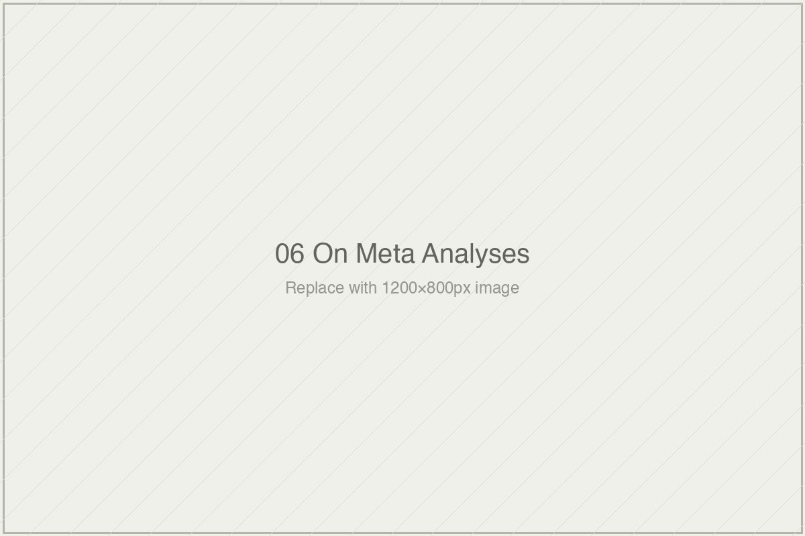

# On Meta-analyses and What They Conceal

*Essai 6*

---

Two numbers sit at the front of this essai. 0.79 sigma for human tutoring. 0.76 sigma for intelligent tutoring systems. Kurt VanLehn's medians from his 2011 meta-analysis, drawn from fifty-four comparisons across twenty-eight studies spanning thirty-five years of research. The two are nearly indistinguishable. They have been cited, for fourteen years since VanLehn published them, as establishing that AI-driven instruction can approach the effectiveness of one-to-one human teaching.

The essai does not tell you the numbers are wrong.

The essai does not tell you VanLehn made a mistake.

The essai asks you to look carefully at what VanLehn's numbers are the numbers *of*. That is a different question, and the difference is the whole project.

---

### What the Essai Does, and What It Does Not

This essai is a close reading of meta-analysis as a genre, with VanLehn 2011 as the specimen. What it refuses to be is an attack on VanLehn, who the writer treats with unusual scrupulousness. VanLehn's inclusion criteria are named. His explicit caveats are foregrounded. His framing of his own findings as a "progress report" rather than as a final verdict is credited. His recommendation that ITS be used as learning supplement rather than as replacement is given the weight it deserves. The writer even admits, in the essai's closing note, that he is not sure he has given VanLehn's methodological seriousness enough credit. The worry is visible in the text.

Whether the essai ultimately holds the line between critique of the genre and reading of the paper — that is a real question. The answer, I think, is mostly yes.

The essai's architecture is patient and cumulative. VanLehn first, and the heterogeneity his aggregation smooths over: studies that differed in duration by three orders of magnitude, in outcome measurement from perfectly aligned developer-designed assessments to maximally distal standardized tests, in populations from adult learners to elementary schoolchildren. Then the alternative meta-analyses — Steenbergen-Hu and Cooper finding 0.05 to 0.09 for K-12 ITS, Kulik and Fletcher finding 0.73 for developer-designed assessments and 0.13 for standardized tests, Nickow-Oreopoulos-Quan finding 0.37 across the whole tutoring literature. Then publication bias, and Rosenthal's Fail-Safe N, and the developer-versus-independent evaluator gap. Then Hattie. Then the citation afterlife of these numbers in Sal Khan's *Brave New Words*, where they arrive shorn of their conditions and do rhetorical work the research contexts never supported.

That is a lot to hold. The essai runs to 5,300 words and does not hurry. A reader who came looking for a verdict about whether ITS works will not find one. A reader looking for the apparatus to ask the question will find more than they came for.

---

### The Genre and Its Artifacts

The deepest claim in the essai, stated flatly in one paragraph and earned across the preceding eight, is this: summary numbers are artifacts of inclusion decisions, not neutral measurements of what the evidence shows.

The writer does not dramatize this. He shows it. VanLehn required individual-level assignment, which excluded cluster-randomized trials. Nickow-Oreopoulos-Quan included them. Each choice was principled. The choices produced different numbers. Not different because one meta-analyst was wrong and another was right. Different because they were doing different things with different materials.

This is the essai's most important pedagogical move, and I want to sit with it for a moment. Most critiques of meta-analysis wave their hands at *garbage in, garbage out* or lament *publication bias* as though naming the problem were the same as equipping the reader to address it. This essai does not wave. It puts Robert Rosenthal's Fail-Safe N formula on the page. It gives you Rosenthal's threshold — that a meta-analytic finding is reasonably robust if the Fail-Safe N exceeds $5k + 10$ — and tells you what the threshold is for. It notes that the statistic has been available since 1979, that the education research literature has by and large declined to compute it, and that a reader who wants to know the robustness of a meta-analytic finding typically has to compute it themselves from what the paper reports.

That is a specific kind of critique. It assumes the reader is capable of doing the work. It gives the reader the equipment. And it names the field's failure to use equipment that has been freely available for four and a half decades.

The Wolf and colleagues finding — that developer-conducted evaluations produce effects approximately 80% larger than independent evaluations of the same class of interventions — does similar work. The essai sits with this number. It does not sensationalize it. It uses it to name a specific consequence: any meta-analysis that aggregates without distinguishing developer-conducted from independent studies is producing a summary that is partially an artifact of who conducted the underlying research. The ITS literature VanLehn aggregated from is heavily populated by developer-conducted evaluations. The implication is concrete, not abstract.

What the essai is doing, across all of this, is teaching you to read. Not to distrust meta-analysis. Not to dismiss it. To see what a meta-analytic summary sigma *is* — an aggregation of studies, under inclusion rules, drawn from a literature that may have publication bias, that may aggregate across heterogeneity the summary smooths over, that may have been produced substantially by researchers with interests in the interventions they evaluated.

The writer is generous enough to put all of this in your hands. The cost of the generosity is that it takes 5,300 words. The gain is that if you stay, you leave equipped.

---

### Hattie, and What the Limit Case Reveals

Then there is Hattie.

The Hattie section does specific structural work in the essai. John Hattie's *Visible Learning*, which aggregated over 800 meta-analyses into a single ranked list of 138 influences on academic achievement, is the limit case — the reductio. If a summary across fifty-four tutoring comparisons is a meaningful quantity, why not a summary across eight hundred meta-analyses of different interventions? If we can aggregate across durations and populations within a category, why not across categories? The logic of aggregation does not self-terminate. Someone had to push it to the endpoint, and Hattie did.

The example the essai cites is the one that lingers. Hattie's "feedback" category, one of the highest-ranked interventions in *Visible Learning* at approximately 0.73 sigma, aggregated — among other things — a study on the effect of background music on the agitation levels of elderly nursing home residents. This is not a caricature. This is what the aggregation actually did. The essai uses the instance precisely to make its point: aggregating across radically dissimilar phenomena produces a number that does not correspond to anything in the world. It is a mathematical operation performed on heterogeneous inputs. The output is a real number. What it is a number *of* is harder to say.

This is why the Hattie section matters beyond its specific target. It reveals what the logic of aggregation does when it is followed past the point where the inputs hold together. The essai's argument — stated earlier, about VanLehn — is that summary numbers smooth over heterogeneity that matters for interpretation. Hattie makes the same operation visible by performing it at scale. The critique that applies to Hattie applies, in smaller form, to meta-analyses that aggregate more principled collections of studies. The essai does not flinch from drawing that connection.

Where I wish the essai had done more is with Hattie's readers. *Visible Learning* has been enormously influential precisely because educators have found it useful. Whatever the methodology's problems, the reception is a real phenomenon — and the answer to *why* it has been received that way matters for what we think meta-analytic summaries actually do in the world, even if what they do is not what their producers claim for them. The essai acknowledges this briefly in its closing note, but the acknowledgment reads thin. This is the one place where I wish the essai had been slower.

---

### The Afterlife of a Number

The section of the essai that I keep returning to is the one on Sal Khan's *Brave New Words*.

The book invokes VanLehn's findings to justify the trajectory from human-led to AI-driven education. The citation is technically accurate in its attribution. VanLehn's paper does report the numbers. VanLehn's paper does note the near-identity of the 0.76 and 0.79. What the citation strips is the context in which those numbers mean what they are cited as meaning — the heterogeneity, the inclusion criteria, the caveats, the alternative meta-analyses with different inclusion rules producing different numbers, the publication bias in the underlying literature.

What remains is the number, detached from the analysis that produced it, circulating as though it were a stable fact about the world.

The writer names this carefully. The citation is not fraud. It is not even careless scholarship. It is a specific rhetorical operation: the use of research findings in contexts where their conditions have been stripped. Meta-analytic numbers produced by researchers who understand their conditions are cited by advocates who understand the headline findings and not the conditions. The distance between research context and citation context is where these numbers do most of their field-level work — licensing investment decisions, policy recommendations, product claims that their original research contexts do not support.

This is the observation that gives the essai its moral weight. Not outrage. Not accusation. Just a careful description of what happens to numbers when they travel, and who benefits from the stripping.

The essai is not interested in making you angry about this. It is interested in making you see it.

---

### What the Essai Leaves in Your Hands

What the reader leaves with is specific, and it is worth naming directly.

The essai does not give you a verdict on whether ITS works. It does not give you a verdict on whether VanLehn's paper was correct. It gives you five questions to ask of any meta-analytic summary — the same five questions Essai 2 of this volume installed, now pointed at aggregations rather than at individual studies. What outcome measures did the aggregation include. What baselines. What populations. What timescales. Under what cost conditions.

These are not gotcha questions. They are questions the summary number, by its nature, is silent about. A citation that strips those conditions is doing rhetorical work, not analytical work. The closing formulation is the one I want readers to carry: a meta-analytic summary sigma cited without its conditions is an invitation to examine the conditions.

You can decline the invitation. Most readers of most meta-analytic citations do.

The essai, having spent 5,300 words showing you what accepting the invitation looks like, now trusts you to accept it next time. That trust is the essai's actual deliverable. What you do with it afterward is your work, not the writer's. And the reason this matters is not that the next Sal Khan talk will be delivered under peer review — it will not — but that you, reading it, will no longer mistake the shape of a confident citation for the substance of what the citation contains.

That is a small thing to ask of a reader. It is also, on the evidence of the last fourteen years of how VanLehn's numbers have traveled, a great deal.

---

**Tags:** VanLehn 2011 meta-analysis ITS, Rosenthal Fail-Safe N publication bias, Hattie Visible Learning feedback critique, developer vs independent evaluator effect sizes, meta-analytic summary sigma interpretive artifact