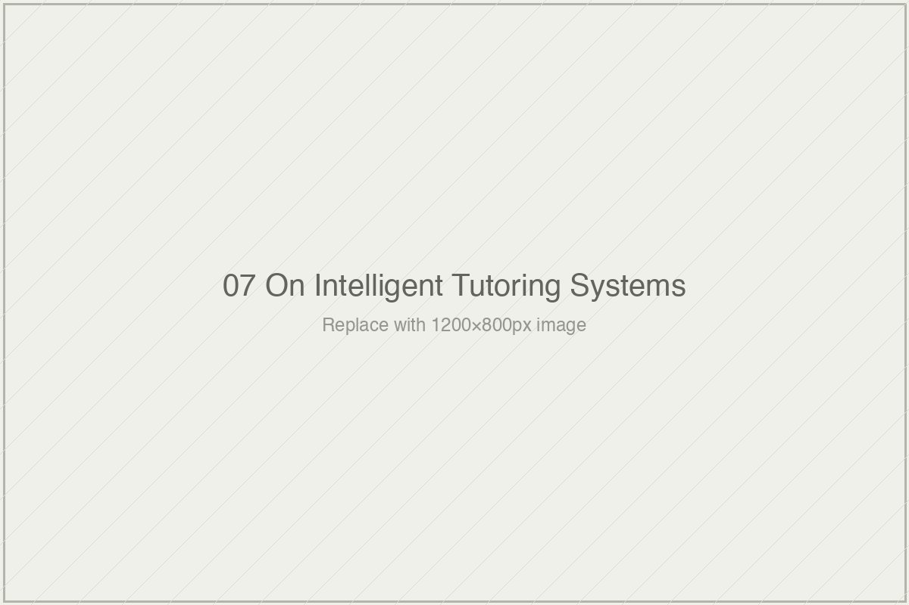

# On Intelligent Tutoring Systems

*Essai 7*

---

## One of Six

---

In 2014, RAND Corporation published what remains the most rigorous independent evaluation of any intelligent tutoring system ever conducted. A cluster-randomized controlled trial across 147 school sites in seven states. Roughly 18,700 high school students and 6,800 middle schoolers. Matched pairs, random assignment, standardized outcome measures, actual school conditions rather than laboratory settings. The study took years to design, years to run, years to analyze. When John Pane and colleagues published their results, they reported the following: no statistically significant effect in year one; approximately 0.20 sigma in high schools in year two; a non-significant effect of similar magnitude at middle schools in year two. The effect, they noted, did not come primarily from individual teachers learning the system — it came from schools, collectively, figuring out how to schedule it, support it, and integrate it into instruction. The cost of implementation was approximately $97 per student per year against roughly $28 per student for traditional textbook instruction.

This, the seventh essai of *[book]* argues, is what the best evidence for ITS — the most disciplined, most expensive, most carefully conducted evaluation the field has produced — actually shows. A modest second-year effect in one population. No significant effect in another. Substantial institutional investment required before any effect emerges at all. These numbers have been the foundation on which the broader field narrative of "ITS disappointment" rests. The disappointment is real to its carriers; ITS was supposed to approach human-tutor effectiveness, and 0.20 sigma in year two at triple the instructional cost is not what approach means. The essai's argument is that the disappointment narrative rests on a specific category error — a comparison between what ITS measured and a construct, *human tutoring*, that ITS was never fully on the same axis with. The gap is not the failure of a technology to reach a benchmark. It is the artifact of a comparison that was structurally underdetermined from the start.

I find this argument the most consequential the book has yet made, and I want to read the essai carefully against its own method before extending it in the direction I think its fourth dimension invites.

---

The essai's structure follows a specific analytical path. First, it establishes what Cognitive Tutor — the ITS it treats as exemplary — was built to do. The system operationalizes John Anderson's ACT-R theory of cognition, which treats skill acquisition as the progressive mastery of production rules: if-then pairings specifying what action a skilled agent takes given a goal and a current state. Cognitive Tutor's technology implements this theoretical commitment through two specific operations: *model tracing*, which evaluates each student step against the system's internal representation of valid production rules; and *knowledge tracing*, which maintains a running Bayesian estimate of whether the student has acquired each rule in the domain. The measurement apparatus follows from the theory: step-level correctness, time per step, hint requests and their hint-level utilization, error patterns and their correspondence to stored misconceptions, estimated mastery of individual productions.

What the apparatus measures, the essai insists, is real. Cognitive Tutor's 0.20 sigma at high schools in Pane's year two is a genuine effect on procedural algebra performance. The system does what it was built to do. The researchers who built it were methodologically transparent about what it did not do — Anderson, Corbett, Koedinger, and Pelletier's 1995 paper is, as the essai rightly emphasizes, a model of such transparency. They acknowledged that their systems did not measure affective state, conceptual confusion above the production-rule grain, transfer to unlike problems, long-term durability, or the student's broader relationship to the material. They did not claim their systems were equivalents to human tutors. The disappointment narrative, as the essai puts it, "came later, from the field's uses of their work, not from the researchers themselves."

Second, the essai examines what the comparison benchmark — human tutoring — actually involves. Here the essai draws on three decades of research into what expert human tutors do, much of it conducted by researchers who also built ITS and who studied human tutoring to inform their systems' design. Art Graesser's videotape analyses documented expectation-and-misconception tailored dialogue, comprehension checks, politeness and face management, and the handling of student-initiated questions the tutor had not planned to address. Michelene Chi's ICAP framework distinguishes Interactive, Constructive, Active, and Passive engagement, and her research program has repeatedly shown that the interactivity of expert tutoring — the prompt-calibrated elicitation of student self-explanation — is a primary driver of conceptual change. Wood, Bruner, and Ross's 1976 paper identifies six functions that a tutor performs in scaffolding a learner through a task: recruitment, reduction of degrees of freedom, direction maintenance, marking critical features, frustration control, and demonstration.

This last list is where I want to pause and develop what I take to be the essai's strongest analytical move.

---

Cognitive Tutor, the essai observes, performs one of the Wood-Bruner-Ross six functions well. *Reduction of degrees of freedom* — the breaking-down of a complex task into tractable sub-operations, with graduated support at each step — is what Cognitive Tutor's step-level scaffolding does, and does with genuine precision. It is what the production-rule model was theorized to support, what the model-tracing machinery was engineered to deliver, what the knowledge-tracing apparatus was designed to track. The system performs this function at a level no human tutor working with thirty students simultaneously could match. This is not a minor achievement. For a specific kind of procedural skill, in a specific kind of domain, at a specific stage of acquisition, step-level scaffolding is real pedagogical work, and Cognitive Tutor does it.

The other five functions are not in the apparatus.

*Recruitment* — the drawing of the learner's interest into the task, the move a tutor makes when a student has not yet decided whether this problem is worth their engagement — is not something Cognitive Tutor attempts. The system assumes the student is present and compliant, which is the school's problem to arrange. *Direction maintenance* — the work of keeping the learner focused on the goal when they drift — is handled, to the extent it is handled, by the system's refusal to advance without demonstrated mastery, which is a coercive rather than interactional form of direction maintenance. *Marking critical features* — the tutor's pointing of attention at what matters, the specific move that says "notice this, this is the thing" — is partially present in Cognitive Tutor's hint sequences, but the hints are pre-specified rather than calibrated to what this student at this moment needs to notice. *Frustration control* — the management of the emotional risk of error, the softening of negative feedback to sustain the student's willingness to continue — is explicitly absent; Cognitive Tutor delivers error messages that are accurate rather than emotionally calibrated, because accuracy is what its apparatus can measure. *Demonstration* — the modeling of expert style, the way a tutor shows rather than tells what a skilled move looks like — is not something the system performs, because its medium is text and its mode is feedback rather than performance.

Now consider what this means for the comparison that has organized forty years of ITS evaluation.

The human-tutoring effect sizes against which Cognitive Tutor's 0.20 sigma has been compared — the 0.4 to 0.8 sigma range that expert human tutors produce across the research literature, Bloom's famous 2.0 notwithstanding — are the aggregate output of all six functions operating together. A human tutor recruits the student's interest, reduces the task's degrees of freedom, maintains direction, marks critical features, controls frustration, and demonstrates. What gets measured at the end is the combined effect of this full interactional repertoire on whatever outcome the study used. Whether the outcome measure is procedural or conceptual, proximal or distal, the intervention being measured is a relationship performing a set of moves the research literature has documented across decades.

Cognitive Tutor's 0.20 sigma, under the same kind of measurement, is the output of one of those six functions operating in isolation. The technology can scaffold. It cannot recruit, maintain, mark, regulate, or demonstrate in the interactional senses the research documents. When the two effect sizes are placed on a single axis — as the field has done routinely, implicitly or explicitly — the implicit claim is that the numbers measure the same construct at different magnitudes. They do not. They measure the output of six-functions-operating-together and one-function-operating-alone. The ratio between the two is not a measure of how far ITS has to go to reach human-tutor effectiveness. It is the expected ratio between a full interactional repertoire and a fractional one. The "gap" the disappointment narrative laments is partly the gap between six and one, read as though it were a gap between ten and eight.

This is what the essai means by structural underdetermination. The comparison was not unfair in any single study — each individual sigma was a report on what a specific intervention produced under specific conditions. The unfairness lives in the aggregation and in the implicit claim that the aggregation supports: that ITS and human tutoring can be placed on the same axis and compared. They can, but only if the comparison is understood as a comparison between one-of-six and all-six, rather than as a comparison between two interventions of the same kind at different effectiveness levels. The field has, in its rhetorical life, preferred the second framing. It has preferred it because the second framing produces the portable numbers that funding applications, product pitches, and policy arguments can carry. The first framing — here is a one-of-six intervention; here is what its effect size supports and does not support — is too conditioned to function as a badge.

The researchers, the essai is careful to note, did not make this error. Anderson and colleagues wrote plainly about what their systems did and did not do. The apparatus that inherited their work, and the institutional machinery that circulated the apparatus, preferred the cleaner comparison. The difference between what Anderson wrote and what the field subsequently said about Anderson is, once again, the gap this book's method is designed to surface.

---

What the essai does that a generic ITS critique would not is refuse both of the easy moves. It does not dismiss ITS as ineffective; Pane's 0.20 sigma is a real effect, and the researchers who built Cognitive Tutor deserve credit for producing it under honest measurement conditions. It does not lapse into a sentimental defense of human irreplaceability; the argument is specifically about what the measurement apparatus indexes, not about what humans intrinsically do that machines cannot. The argument is empirical and structural: here are six documented tutoring functions; here is which one ITS performs; here is what comparison on a single sigma axis therefore supports.

The closing extension to contemporary AI tutors is the move I find most consequential and, as the essai itself flags, most vulnerable to overreach. The generative-AI framing suggests that large language models have finally solved the ITS limitation — that Khanmigo and Kestin and Eedi and Rori can perform the interactional moves production-rule-based systems could not. The essai grants that the interaction layer has changed. What it insists has not changed is the measurement layer. The current AI-tutor evaluations still measure what the earlier ITS evaluations measured: item-level mastery, step-level performance, post-test scores on aligned assessments, immediate short-term outcomes. Whether the new interaction layer actually produces the interactional functions the earlier systems could not is not established by measurements that index only procedural scaffolding. It can be claimed on the basis of such measurements only by repeating the category error the ITS tradition has been making for forty years. The claim may be true. The evidence does not, currently, speak to it.

---

The essai equips the reader with three questions, and I want to carry them forward because they are the portable tool the book's method keeps generating.

What did the technology actually measure — and was that measurement aligned with what it was built to do? If yes, the evaluation supports claims about that specific construct and no other. What does the comparison benchmark actually involve — what are the full set of moves the construct *human tutoring* indexes in the research literature? And was the comparison conducted on an axis that indexes both sides, or only one? The third question is where the category error lives, and where it is most often concealed. A comparison on a single-function axis, called a comparison between a technology and human tutoring, is doing rhetorical work the axis does not support.

What the essai gives the reader is not a verdict on ITS or on AI tutors. It is a method for reading any human-versus-machine comparison in the learning-systems field with the apparatus restored. The researchers knew what they were measuring. The apparatus that circulates their numbers often does not. When you next encounter a claim that an AI tutor has "approached the effectiveness of human tutoring," you now have the questions to ask. Whether you receive answers is a separate question, and one the rest of this book continues to examine.

Bloom wrote in 1984 that the teacher is more important than ever, and his number escaped the sentence. Anderson and Koedinger wrote in 1995 that tutors work better when they present themselves to students as nonhuman tools, and their number escaped the sentence. The apparatus preserves numbers. It does not, structurally, preserve the conditions the numbers were produced under or the claims the researchers made alongside them. This essai restores the conditions to Cognitive Tutor's number. The gap between one of six and six of six is not a gap to be closed. It is the honest shape of what the measurement has always been.

---

**Tags:** Cognitive Tutor Algebra I RAND evaluation, Wood Bruner Ross scaffolding six functions, intelligent tutoring systems construct validity, Art Graesser AutoTutor dialogue research, ITS versus human tutoring comparison critique