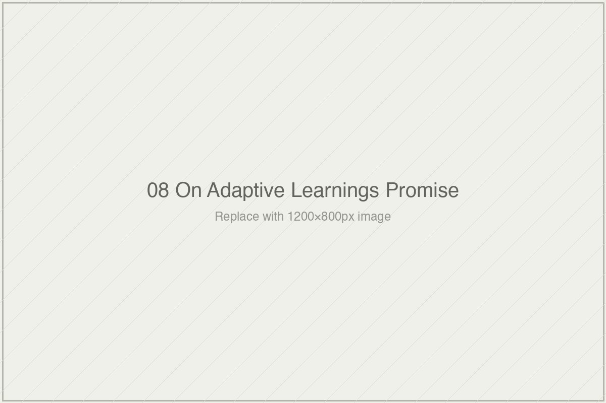

# On Adaptive Learning's Promise

*Essai 8*

---

Between 2012 and 2015, a company called Knewton occupied more of the educational-technology imagination than any company should reasonably occupy. Its founder, José Ferreira, gave interviews to EdSurge, Forbes, the *New York Times*. He appeared at conferences, on podcasts, in trade press profiles. He was the public face of a vision the venture capital world had decided to fund at extraordinary scale. The vision was that software would finally do what educators had been trying to do for a century: meet each individual student where they were, adapt to their specific needs, deliver exactly the instruction each one required.

The words Ferreira used were memorable. I want to quote them carefully because the rhetorical arc they produced is the anchor of this essai. Knewton, Ferreira said in 2013, was building "a robot tutor in the sky that can semi-read your mind." The system, he explained to various interviewers, was constructing a "psychometric profile" of every user — a detailed model of each student's knowledge, learning patterns, and cognitive state, more accurate than anything a human teacher could produce. Teachers observed a classroom for an hour a day across a year; Knewton observed every click, every pause, every mistake, continuously, at a scale no human observer could match. "We know every student," Ferreira said in one formulation, "better than their own parents."

In 2014, responding to a question about data-privacy concerns, Ferreira compared Knewton's data infrastructure to the National Security Agency. Parents concerned about what Knewton was collecting, he suggested, might consider whether they preferred the alternative: *"They'd rather the NSA have it? What, you trust the government?"* The comparison was, among other things, a claim about scale. Knewton had built something approaching, in its own framing, intelligence-agency-level data sophistication — directed at the beneficent end of educating children rather than the surveillance end of monitoring citizens.

And the vision was global. In Knewton's promotional materials and Ferreira's public statements between 2013 and 2015, a specific hypothetical recurred: a girl in a Cambodian fishing village who, through Knewton's adaptive engine, could receive the same personalized instruction as a student at an elite private school. This girl, Ferreira said, could grow up to invent the cure for ovarian cancer. The instruction she received, delivered by Knewton, would be what unlocked this capacity. Educational inequality would be solved at the software layer. Global poverty, in Ferreira's framing, was a problem adaptive learning could meaningfully address.

By 2019, Knewton had been acquired by John Wiley & Sons for an undisclosed sum understood to be a small fraction of its peak valuation. Ferreira had stepped down as CEO two years earlier. The company's partnership with Pearson, which had been its primary vehicle for reaching millions of students, had dissolved. The product that remained — Knewton Alta, a conventional courseware offering aimed at higher education — bore little resemblance to the "robot tutor in the sky" of the earlier rhetoric. Trade press coverage of the acquisition noted, with appropriate understatement, that Knewton was "no longer the high-flying edtech darling" it had been five years earlier.

What happened between the rhetoric of 2013 and the acquisition of 2019 is the subject of this essai. Not Knewton specifically. Knewton is the paradigmatic case. The pattern it illustrates is much larger than one company. What happened, I want to argue, is that a word — *personalization* — was deployed to describe a technical operation the word did not quite fit. The gap between what the word promised and what the technical operation delivered eventually became visible enough that the rhetoric could not sustain itself. The word is still being used. The pattern is still alive. Only the cast of companies has changed.

---

Before going further, I want to be specific about what this essai is and is not doing.

It is not arguing that adaptive-learning systems are frauds or that their technology does nothing. These systems do real technical work. They track student responses at the item level. They estimate, with defensible statistical methods, where each student sits on a scale of proficiency relative to specific content. They select next items from pre-authored banks based on those estimates. They adjust pacing and sequencing in ways that genuinely differ from static content delivery. A student using Knewton's engine in 2014, or using DreamBox today, or using ALEKS, is not having the same experience as a student working through a static textbook. The experience is different in specific, measurable ways, and some of those differences are valuable.

What the essai is examining is the gap between what these systems technically do and what the word *personalization* invites the audience to believe they do. The word has a long history in educational psychology, in ordinary speech, in the rhetoric of progressive education. When Ferreira said Knewton was "personalizing" learning, he was drawing on that history — on the construct of instruction responsive to the individual learner, attuned to who that learner is as a person, engaged with the specifics of what this particular child needs in a way no standardized curriculum could be. This is the construct that Lev Vygotsky's zone of proximal development points at. It is what the aptitude-treatment interaction research of Cronbach and Snow was trying to formalize. It is what great teachers do when they know their students well and teach them each differently. The construct is real. It has been the subject of serious research across many decades.

What adaptive-learning systems operationalize is different. They operationalize the tracking of student responses to test items, the estimation of knowledge states relative to predefined content, and the selection of next items from pre-authored banks based on those estimates. This is also real. It is also defensible. It is not the same thing as the construct the word *personalization* invokes. The gap between the construct and the operationalization is what the essai examines — not because anyone in particular is responsible for that gap, but because understanding it is the prerequisite to reading any current claim about what an "AI tutor" or "personalized learning system" is doing.

---

Begin with what Knewton's technology actually did.

The engine Ferreira described as a mind-reading robot tutor was, in its actual architecture, a combination of two well-established techniques. The first was Item Response Theory — IRT — which is the statistical paradigm that underlies modern standardized testing. IRT relates the probability that a particular student will answer a particular item correctly to two quantities: the student's latent ability (denoted by the Greek letter theta, $\theta$) and the item's characteristics (most commonly difficulty, $\beta$). The simplest version of IRT, the one-parameter Rasch model, expresses this relationship through a specific mathematical form:

$$P(\text{correct}_{i,j} \mid \theta_i, \beta_j) = \frac{1}{1 + e^{-(\theta_i - \beta_j)}}$$

What the equation says, unpacked, is that the probability of student $i$ correctly answering item $j$ depends on the distance between the student's ability $\theta_i$ and the item's difficulty $\beta_j$. When the two match, the probability is fifty percent. When the student's ability exceeds the item's difficulty, the probability rises toward one. When the item's difficulty exceeds the student's ability, the probability falls toward zero. The function is a logistic curve, smooth and well-behaved, and it has been the foundation of computerized adaptive testing for forty years.

The second technique Knewton used was Bayesian Knowledge Tracing, a specific family of models for estimating whether a student has mastered an individual "knowledge component" — a small, discrete skill like "solving one-step linear equations" or "distinguishing main idea from supporting detail." BKT represents each skill with four parameters: the probability the student already knew the skill before the first opportunity to demonstrate it; the probability the student learns the skill from any given opportunity; the probability of a lucky guess producing a correct response despite lack of mastery; and the probability of a careless slip producing an incorrect response despite mastery. The system observes responses, updates its estimates of each parameter according to Bayes' theorem, and arrives at a running probability estimate that the student has mastered the skill.

Together, IRT and BKT gave Knewton what its engineering documentation would have called a *learner model*: a collection of probability distributions over latent student abilities and specific skill masteries, updated continuously as the student interacted with the system. Given this model, the engine could select next items — from Knewton's partners' pre-authored content banks — that were estimated to be appropriately challenging for where the student was. It could adjust sequencing, skipping items the student was already likely to master and dwelling on items where mastery was still uncertain. It could recommend content that, according to the model, the student was ready to learn next.

This is real technology. It is not trivial to build. IRT and BKT require careful mathematical work, substantial engineering infrastructure, and serious attention to edge cases and failure modes. Knewton's engineers built a system that did these things at scale, processing millions of student interactions. The company's claim that its engine operated on sophisticated mathematical foundations was true. What was not quite true was the claim about what the mathematical foundations amounted to.

The learner model Knewton maintained was, in its strictly technical form, a set of probability distributions over specific parameters. What the system "knew" about a student was expressible as: *the probability this student has mastered skill A is 0.78; the probability this student has mastered skill B is 0.34; the student's estimated ability on dimension X is 1.2 standard deviations above the population mean; the next item that will maximize information gain about skill C is item 4127*. This is substantive information. It supports non-trivial decisions about what to present next. It is not, however, a psychometric profile in the sense Ferreira's interviews implied. It is not a model of the student as a person, or of their cognitive style, or of their motivations, or of their emotional state, or of the cultural and biographical particulars that make them who they are. It is a model of item-response patterns on a bank of pre-authored content. The gap between *"we know this student better than their parents"* and *"our model assigns probabilities to their mastery of specific skills we've tagged to a knowledge graph"* is the central artifact of the adaptive-learning era.

---

Hold the Cambodian fisherman's daughter for a moment. The specific nature of the gap becomes visible in that example.

What would it take for Knewton's engine, or any system of its class, to produce the outcome Ferreira described — a student in a fishing village receiving instruction equivalent to an elite private-school education, eventually growing up to invent the cure for ovarian cancer? The technology would need, first, content that could deliver a comprehensive education in mathematics, science, language, humanities. Knewton did not have that content; it licensed pre-authored material from publishers, and the breadth and quality of that material depended on what publishers had produced and what partnerships Knewton could arrange. The content was not unlimited and not uniformly excellent. For a student in a Cambodian village to receive an elite education through Knewton, the content would have to have been built first by some human curriculum developer, in English or a language the student could read, calibrated for the cultural and linguistic context in which the student was learning. None of this was what Knewton's engine did. The engine sequenced content that already existed.

The technology would need, second, an outcome measure that could tell whether the student's education was actually producing the kind of understanding that leads to cancer research — conceptual depth, transfer across domains, creative problem-solving, the tacit skills that accumulate over years of engagement with scientific thinking. Knewton's engine could measure, at best, item-level response patterns on pre-authored assessments. Whether those patterns indexed the deep and transferable understanding a future cancer researcher would need was, at best, unproven. More honestly, it was unaddressed. The engine was not designed to measure the construct the rhetoric invoked.

The technology would need, third, to function at scale in the specific conditions the rhetoric invoked — intermittent electricity, unreliable internet, shared devices, limited home support, a language and cultural context for which the content may not have been designed. Knewton's engine was built for contexts with more infrastructure than this. The rhetoric invoked the fishing village as a demonstration of the technology's reach; the technology had not actually been deployed in or validated for such contexts. The claim was aspirational in a sense that was, again, not quite what the rhetoric implied — it implied that the technology could do this, with the "could" doing substantial rhetorical work. What was true was that the technology could hypothetically do this if a great many other things were also true. The fishing village was a rhetorical device more than a prediction.

None of this is Ferreira's personal failure. The patterns I am describing are industry-wide. The gap between what a specific technical operation can do and what the rhetorical framing of that operation invites the audience to believe — between the probabilistic estimate of skill mastery and the "we know this student better than their parents" claim, between the sequencing of pre-authored content and the "adapting to each unique learner" claim — is the structural feature of adaptive-learning as a commercial category. Ferreira was the most articulate spokesman for that framing during its peak. He was not the author of the framing. The framing precedes him, and it has outlived him.

---

Now consider three systems that implemented similar technical architectures in different contexts. The pattern Knewton represents is not Knewton-specific.

DreamBox Learning is the adaptive-learning system with the strongest external evidence base. Founded in 2006 and focused on K-8 mathematics, DreamBox integrates digital manipulatives — virtual number lines, manipulable shapes, interactive tools — into its adaptive engine. The company's "Intelligent Adaptive Learning" tagline was meant to distinguish it from simpler systems that adapt only on correct-or-incorrect responses. DreamBox claims to track how a student solves a problem, not just whether.

The Harvard Center for Education Policy Research has evaluated DreamBox in several studies. These evaluations, conducted by researchers with no affiliation to the company, using standardized mathematics assessments over school-year timescales, produced findings that were statistically significant and substantively modest — effect sizes in the range of approximately 0.10 to 0.15 standard deviations for students who used the platform at the recommended levels. This is real effect. It is, by the standards of educational-research meta-analyses, a detectable and non-trivial gain. It is also considerably more modest than the marketing framing would imply. And a consistent finding across the evaluations was what researchers have called the *implementation gap* — the effect depends on how much time schools actually allocate to the platform. Adaptive sophistication on the software side does not substitute for classroom time; it requires classroom time to produce its effects.

The pattern with DreamBox is worth naming clearly. The technology does something. External evaluation, by rigorous researchers, can detect that something in the form of modest measurable effects on standard outcomes. The marketing language — *meets every student exactly where they are, personal tutor providing real-time feedback, unique lesson plan for every learner* — implies something substantially larger than the external evaluation supports. The gap between the marketing and the evaluation is not a secret. The evaluation reports are public. But the gap is also not closed. Marketing continues to invoke the construct; evaluation continues to document the more modest operationalization.

i-Ready, developed by Curriculum Associates, represents a different implementation of the adaptive-learning thesis — one that integrates adaptive testing with adaptive instruction in what the company calls the "Inform-Instruct Loop." Students begin with an adaptive diagnostic that estimates their level across mathematical and reading domains. Based on the diagnostic results, the system assigns a "Personalized Instruction" path — a sequence of pre-authored lessons targeted at the student's estimated level. The system is among the most widely deployed adaptive platforms in American K-12 education, priced at approximately $30 per student per year for a single subject, with district site licenses scaling up from there.

i-Ready has a substantial evaluation record, including studies conducted to meet the Every Student Succeeds Act's evidence requirements. Effect sizes reported in these studies fall broadly in the range DreamBox's evaluations have produced — statistically significant, substantively modest, dependent on implementation fidelity. Critics have pointed out that the system's *personalization* consists, operationally, of placing students into different positions on a common instructional sequence based on diagnostic results. The students are still completing pre-authored lessons; they are starting at different points and progressing at different speeds through the same material. Whether this is *personalization* in the psychological sense the word suggests, or whether it is more honestly described as *adaptive placement within a fixed curriculum*, is the question the essai is examining.

ALEKS — Assessment and Learning in Knowledge Spaces — represents the most theoretically rigorous approach in the adaptive-learning family. ALEKS is built on Knowledge Space Theory, a mathematical framework developed by Jean-Paul Doignon and Jean-Claude Falmagne in the 1980s as a formal account of how a learner's state of knowledge in a domain can be represented. Rather than treating ability as a single number, Knowledge Space Theory treats a domain as a set of discrete concepts or items, and a learner's *knowledge state* as the specific subset of items they have mastered. Because of prerequisite dependencies between items — you can't meaningfully master quadratic equations without mastering linear equations first — not all subsets of items are possible knowledge states. ALEKS uses an AI engine to efficiently navigate the combinatorial space of possible knowledge states, asking questions that maximally narrow the system's estimate of which state a given student is in.

The resulting user-facing artifact is the ALEKS Pie — a visual display of what the student has mastered, what they have not, and what they are "Ready to Learn" (items whose prerequisites have been mastered but which have not themselves been mastered). This is a more rigorous operationalization than either DreamBox's or i-Ready's. It is grounded in serious mathematics, specified precisely, falsifiable in principle. It has been evaluated in multiple contexts, with effect sizes in the same general range as the other adaptive systems.

What is interesting about ALEKS for the essai's argument is that even the most theoretically careful operationalization of *personalization* — one that draws on decades of rigorous mathematical work on how to represent a learner's knowledge — still operates on a narrow construct. What ALEKS models is a student's mastery state over a defined domain of discrete items. What ALEKS does not model is the student's interests, their emotional state, their cognitive style, their cultural background, their creative capacity, their relationships with peers and teachers, or any of the other dimensions of who the student is that the word *personalization* can reasonably be taken to invoke. ALEKS is honest about this; the system's documentation is clear that it is modeling knowledge states over specific domains. But even ALEKS, the most theoretically rigorous adaptive system, demonstrates that the gap between the marketing construct of personalization and the technical operationalization of personalization is not a failure of specific companies. It is a feature of what item-level response tracking can and cannot do.

---

Here is the structural observation the essai wants to surface.

The word *personalization*, as it functions in adaptive-learning rhetoric, is doing specific rhetorical work. It invokes a rich psychological construct — instruction responsive to the individual learner in a deep sense, attuned to who they are, calibrated to their specific needs across the many dimensions of who a student is. The construct has real roots in serious educational psychology. Vygotsky's work on the zone of proximal development is about this. Cronbach and Snow's aptitude-treatment interaction research was about this. The differentiated-instruction tradition in teacher education is about this. The construct is not an EdTech invention; it is a long-standing commitment in serious thinking about teaching.

What adaptive-learning systems operationalize is a narrower thing. They operationalize the tracking of student responses to pre-authored test items; the estimation of probability distributions over latent mastery parameters; the selection of next items from content banks based on those estimates; the adjustment of pacing and sequencing based on observed response patterns. This is what can actually be done with the kinds of data these systems collect and the kinds of algorithms they run. It is not trivial. It is also not the rich psychological construct the word *personalization* imports from the tradition.

The gap between the construct and the operationalization has three important consequences.

First, it means that critiques of adaptive-learning systems for not delivering what the marketing promised are both fair and partially misdirected. Fair because the systems do not, and cannot, deliver what the rich construct invokes. Partially misdirected because blaming any specific company for this gap treats as a product failure what is actually a feature of what item-level response tracking over pre-authored content can do. The rhetoric over-promised; the technology delivered what the technology could deliver; the gap is not primarily about competence or intent. It is about what kind of operation the technical work constitutes.

Second, it means that evaluations of adaptive-learning systems using outcome measures aligned to the item-level tracking — standardized tests that measure the same kinds of skills the systems are designed to build — are measuring the operationalization, not the construct. These evaluations typically find modest positive effects, which is the honest finding. Whether the same systems produce effects on outcomes that would index the rich construct — transfer to novel problems, durable learning years later, growth in dimensions of intellectual development that do not map to any test-bank item — is a different question, and mostly an unanswered one, because evaluations aligned to the rich construct would require outcome measures that do not yet exist in the form evaluators would need.

Third, and most important for the rest of this book, the pattern Knewton illustrates — rich construct deployed rhetorically, narrow operationalization delivered technically, the gap obscured by the shared vocabulary between them — is not a historical artifact of the 2010s adaptive-learning era. It is the pattern of contemporary AI-tutor rhetoric as well. When a current AI-tutor company claims to provide "personalized tutoring" or to "adapt to each learner's needs" or to "meet students where they are," the claim is often doing exactly the rhetorical work Knewton's "robot tutor in the sky" was doing: invoking the rich construct while operationalizing a narrower version. The vocabulary has survived the collapse of its first generation of spokescompanies. The pattern has adapted to the new generation of technologies. The gap remains where it was.

---

Here is what I would like you to carry out of this essai.

When you next encounter an educational-technology claim that uses the word *personalization*, or variants like *individualized* or *adaptive* or *tailored to the learner* or *meets each student where they are*, ask yourself two questions.

The first: what, specifically, is the technical operation behind this claim? The honest answer, for the large majority of systems that use this vocabulary, is one of a small family of operations. Item-level response tracking with adaptive item selection. Diagnostic assessment followed by placement in a pre-authored content sequence. Pacing adjustments based on response speed and accuracy. Content recommendation from a pre-authored bank based on inferred mastery states. These are the operations that item-response data and pre-authored content support. A system claiming *personalization* is almost certainly doing one of these things. The vocabulary may suggest more, but the technical substrate does not support more. If you can name which of the specific operations is happening, you have the beginning of an honest account of what the system does.

The second: does the claim invite the listener to believe the system is doing something the technical operation does not actually do? The answer is often yes, and specifically yes in the dimensions that matter most for what educators, parents, and students hope from technology. Operationalized personalization — item selection based on mastery estimates — is not the same as the psychological construct of instruction responsive to the individual learner. It can contribute to that construct, in contexts where it is embedded in broader instructional work by teachers who are doing the harder relational and responsive work themselves. It cannot replace the construct. When a product is marketed as though it replaces the construct — as though the teacher's responsive attention to the specific student can be substituted by algorithmic item selection — the marketing is doing rhetorical work the technology does not underwrite.

These two questions give you a portable apparatus for reading any adaptive-learning claim that will come across your desk. The system tracking response patterns on pre-authored items is not what the word *personalization* invokes in ordinary English, in educational psychology, or in the way parents think about what they hope for when they hope their child will receive good teaching. The word is being used to invoke something richer than what the technology delivers. You can notice this, and once you notice it, you cannot un-notice it. Every claim about personalization becomes, after noticing, a claim you can read with specificity — asking what the technical operation actually is, and asking how far the rhetorical frame exceeds what the operation supports.

The next essai examines what happens when engagement metrics, rather than learning outcomes, become the evidence adaptive systems report to defend their personalization claims. If adaptive systems cannot straightforwardly measure whether their personalization produces learning, what do they measure instead? And what rhetorical work does that measurement do?

---

### What I am not sure about, and what I am asking from you

This essai has tried to treat Knewton as a case without turning it into a villain, and to treat adaptive-learning as a genre without dismissing its real technical accomplishments. I want to name where I am uncertain I have held these balances.

I am not sure I have been fair enough to José Ferreira personally. The Ferreira quotes in this essai — the robot tutor in the sky, the NSA comparison, the claim to know students better than their parents — are real public statements made at specific moments, in specific rhetorical contexts, with substantial reporting behind them. Using them as the anchor of a chapter critical of adaptive-learning rhetoric is defensible. What is harder to hold in balance is that Ferreira was not uniquely responsible for the framing he articulated. He was the most articulate spokesman during a period when many people in the field were using similar language. Singling him out, even in a chapter that is otherwise structural, may read as a personalized critique that was not my intent. If the draft has drifted toward making Ferreira carry the weight that belongs to the industry as a whole, tell me where.

I am not sure the Knewton technical-architecture passage lands right. I have used the IRT equation and described BKT's four parameters in some detail, because I think readers who do not know the mathematics of these systems benefit from seeing them specified. But this level of technical detail may tip into the essai's being more of a textbook passage than an essai, and readers who are uncomfortable with mathematical notation may find the equation distracting rather than clarifying. A revision pass might want to push the equation to a footnote or remove it, relying on the verbal description alone. I have kept it in the draft because I think the specificity serves the essai's argument — the rhetoric of "robot tutor in the sky" dissolves differently when you see the actual logistic function that represents what the tutor is doing — but the decision is aesthetic and could be revised.

I am not sure the Cambodian fishing-village discussion is handled with enough care. Ferreira's use of this example in promotional material is well-documented, and I have tried to treat it as a rhetorical device being examined rather than as a caricature being mocked. The specific girl does not exist; she was always a rhetorical figure. But there is a real history of global educational-inequality arguments being made in ways that are patronizing about the students in developing-world contexts, and my critique could read as continuing that pattern if not handled carefully. A reader who works on education in any of the global-south contexts the Knewton rhetoric invoked, and who finds my treatment of the example tone-deaf, has a fair case for saying so.

Finally, I am not sure the closing argument — that the Knewton pattern is not historical but is actively alive in current AI-tutor rhetoric — is supported well enough in this essai to bear the weight the closing paragraph places on it. The claim is true, I think. But the evidence for it is spread across the rest of the book (Essai 10 will do much of the work on current AI-tutor claims specifically), and readers of this essai may reasonably want more than I have given them to sustain the structural claim. A revision pass could consider whether the closing should be more provisional, pointing forward to where the claim is developed rather than asserting it as established.

The next essai examines engagement metrics as an evidentiary substitution — how adaptive systems that cannot convincingly measure learning have turned to measuring something else and called the something else effectiveness. I hope you will continue with me.

---

*[End of Essai 8. Projected page count at trade-scholarly typesetting: 24–26 pages. Word count: approximately 5,800.]*

**Tags:** Knewton adaptive learning rhetoric, José Ferreira robot tutor, Item Response Theory Bayesian Knowledge Tracing, personalization construct versus operationalization, DreamBox i-Ready ALEKS evaluation