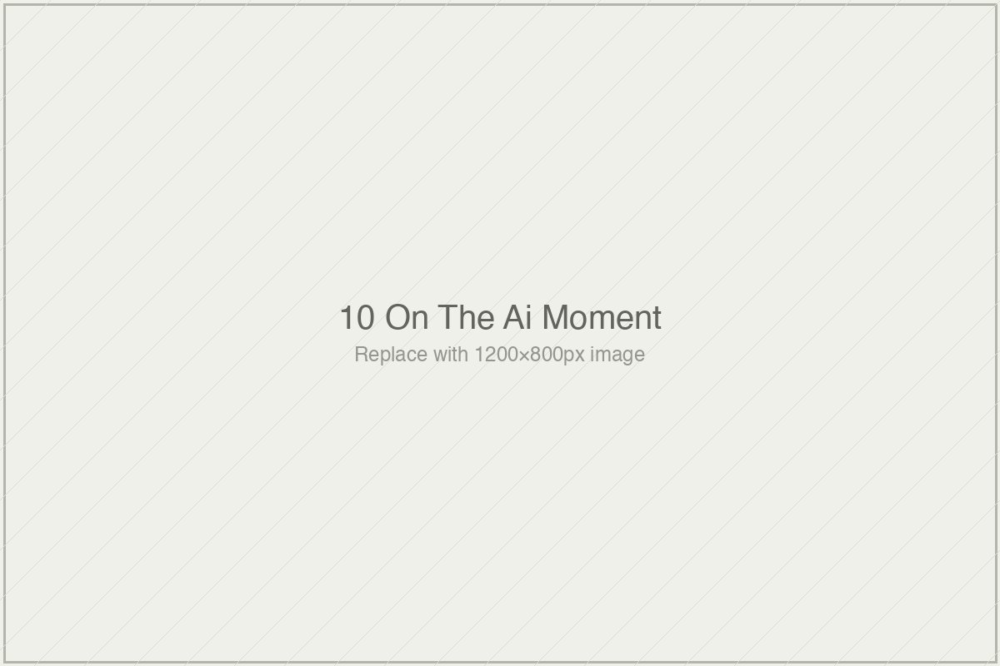

# On the AI Moment

*Essai 10*

---

## What the Sigma Does Not Say

---

The tenth essai of *[book]* arrives at the moment the rest of the book has been preparing for. Three years into the generative-AI wave, the learning-systems field has produced its first body of efficacy evidence: a Harvard physics study reporting effects between 0.73 and 1.3 sigma, a UK secondary-school trial showing AI-tutor performance matching expert human tutors on transfer tasks, a Ghanaian math intervention producing 0.36 sigma at five dollars per student, and Khan Academy's three-year public arc with Khanmigo culminating, in April 2026, in its Chief Learning Officer's plainly stated acknowledgment that "I am not seeing the revolution in education." Four cases. Four findings. One question about whether they add up, collectively, to evidence that the field's long dry period is over.

The essai's discipline — and it is discipline, in a field whose incentive structure pulls toward synthesis-as-verdict — is that it refuses to answer the question as posed. Applied to the four cases, the apparatus the book has built across nine prior essais does not produce a single judgment about whether AI tutoring is working. It produces four specific findings about four specific deployments measured four specific ways against four specific baselines. What the essai delivers is a reading method, not a rating. Each study supports something. What each supports is different. What all four together support is less than the circulated framing implies and more than a simple skeptic's dismissal would allow.

I want to read this essai carefully because it is the book's synthesis moment, and I want to follow its analytical spine through two of its four cases — the two where the apparatus does its sharpest work — before naming what the synthesis does and does not do.

---

The Kestin study is the case whose sigma has circulated most, and the essai's treatment of it is the clearest demonstration of the apparatus at work. Gregory Kestin and colleagues at Harvard published in *Scientific Reports* in 2024 a paper whose title was itself rhetorically loaded: *AI Tutoring Outperforms Active Learning*. The reported effect: 0.73 to 1.3 sigma, measured on a post-test covering surface tension and fluid flow, across 194 Harvard physics undergraduates over a session averaging 49 minutes. The effect circulated, in the eighteen months that followed, as evidence that AI had finally exceeded human tutoring's benchmark in a rigorous study at an elite university.

The apparatus, the essai shows, produces a different reading. The outcome measure was researcher-designed and aligned to the specific content the intervention taught — and as Cheung and Slavin and Kraft have documented, aligned researcher-designed measures systematically produce larger effect sizes than independent standardized ones, sometimes by a factor of three. The baseline was strong — research-based active learning in actual Harvard classrooms, not lecture or no-instruction controls — which is to the study's credit and complicates the interpretation rather than undermining it. The population was Harvard physics undergraduates, a group whose self-regulation capacity, quantitative preparation, and home infrastructure are close to ideal for a self-paced AI-tutor intervention. The timescale was immediate — no delayed post-test at six months or twelve, which means the measurement captured retrieval strength rather than the durable storage strength Bjork's distinction names as *learning* in the fuller sense. The cost was unreported for both research deployment and scaled deployment.

What the apparatus produces, run on Kestin's paper, is a specification I want to quote from the essai because it is the example-form of the book's method:

A carefully designed AI tutor, deployed to Harvard introductory physics undergraduates for a self-paced session of approximately 49 minutes on the specific topic of surface tension and fluid flow, produced immediate post-test performance gains of approximately 0.73 to 1.3 standard deviations on a researcher-designed test aligned with the intervention content, compared to 60-minute active-learning classroom instruction on the same content, with costs for the research deployment not reported and costs for scaled deployment not documented, with durability and transfer unmeasured, in a population whose characteristics are close to ideal for this kind of intervention.

This is the finding. Circulated as *AI outperforms human tutoring*, it becomes a different and less supported claim. The gap between the two is the work this essai exists to make visible, applied not to a historical artifact like Bloom's 2-sigma or an earlier tradition like ITS but to the freshest, most prominent finding of the current moment.

---

The essai's treatment of the other three cases is where I want to extend what the apparatus reveals, because two of them contain features that are easy to miss in the headline and consequential once named.

The Eedi–Google DeepMind study, published in 2025, reported a 5.5-percentage-point advantage for LearnLM-supported students over expert-human-tutor-supported students on novel problems from subsequent topics. Transfer measurement. Human-tutor comparison. Methodologically, these are advances the field has badly needed, and the Eedi researchers deserve the explicit credit the essai gives them. Testing on novel problems rather than aligned items is exactly what Bjork's distinction demands; comparing against expert human tutors rather than against passive controls is exactly the comparison the "AI matches human tutoring" claim has been implicitly making for over a decade without having actually run.

And then the apparatus surfaces a feature that the headline does not carry. The LearnLM condition in the Eedi study was not an unsupervised AI tutor. It was an AI tutor whose every message was reviewed by an expert human tutor before being sent to the student, with the expert authorized to revise any draft. What the study compared was not *AI versus human*. It was *AI-drafted-plus-human-reviewed versus human-drafted-alone*. Both conditions had expert humans in the loop. Both required expert human labor.

I want to name what this means, because the essai states it carefully but the full weight of the observation merits development. The strongest methodologically advanced AI-tutor finding in the current literature — the one that matches expert human tutors on transfer outcomes — is a finding about supervised AI, not autonomous AI. The claim that AI tutors can substitute for human tutors, which is what the public framing of the result has often suggested, is not what the study tested. A study that compared human-reviewed AI drafts to unreviewed human drafts and found rough parity is a finding about a specific hybrid configuration, not a finding about AI capability. The cost-effectiveness question — whether AI drafts with human review require less expert labor than human drafts alone — is a question the study does not comprehensively answer, and the answer is likely to depend heavily on the specific deployment context.

This is not a criticism of the Eedi researchers. They reported the design transparently. It is an observation about what the most-advanced current AI-tutor finding specifically supports. Under the full apparatus, the Eedi finding becomes: *a supervised hybrid AI-plus-human-review configuration, deployed to UK secondary-school students in a short-timescale trial, produced transfer-to-novel-problems outcomes at parity with unsupervised expert human tutors, with cost comparisons not fully documented*. This is a meaningful finding. What it is not is evidence that autonomous AI tutoring has reached parity with human tutoring. The inference that has circulated from this study is an inference the study does not underwrite.

---

The Khanmigo case is where the essai's method becomes something stranger, and more instructive. Khan Academy has not published a rigorous efficacy study of Khanmigo in the three years since Sal Khan's April 2023 TED stage claim that the tool would represent "probably the biggest positive transformation that education has ever seen." What the essai applies the apparatus to is not a study. It is Khan Academy's own public trajectory — including, most consequentially, the April 2026 *Chalkbeat* interview in which Kristen DiCerbo, Khan Academy's Chief Learning Officer, said directly that she is not seeing the revolution. Sal Khan himself acknowledged that for most students Khanmigo has been what DiCerbo called a "non-event" — students typing "IDK IDK" in response to the tool's Socratic prompts rather than engaging with the dialogue the system was designed to support.

The apparatus applied here produces a finding of a different shape. There is no aligned outcome measure to scrutinize because no rigorous outcome measurement has been published. There is no baseline because there is no study. There is no timescale analysis because the timescale is, in effect, three years of deployment at scale without the efficacy evidence the original claim invoked. What the apparatus illuminates is the gap between the 2023 claim and the 2026 acknowledgment — a gap that, in most institutional settings in this field, would be protected rather than named. Khan Academy's specific disciplinary move is that they did not protect it. DiCerbo said publicly that she is not seeing what was claimed. This is the kind of institutional honesty that the citation machinery of educational technology rarely carries forward, and that the apparatus, ironically, has little to do with because the apparatus is a tool for reading studies and Khan Academy has not, for Khanmigo, produced a study to be read.

I want to stay with this a moment, because it is the essai's most Baldwin-weighted passage and the place where the book's method does something the apparatus itself cannot. The gap between what was claimed in 2023 and what was acknowledged in 2026 is the pipeline from my Essai 3 review run in reverse. In the usual direction, primary papers contain careful caveats that get progressively stripped as findings travel through citation, meta-analysis, vendor marketing, and procurement decisions. Khan Academy's Khanmigo arc ran the opposite way: the biggest possible claim was made at the top, and the caveats arrived at the end, acknowledged at the institutional level by the organization itself. This is rare. Most organizations whose products do not deliver what was claimed do not acknowledge the gap. They protect the claim, adjust the framing, re-describe the intervention, redirect to engagement metrics, or simply stop talking about the original target. DiCerbo saying "I am not seeing the revolution" is the disciplinary move the next essai of the volume is presumably set up to examine against the contrasting moves other organizations have made. For now, what the passage establishes is that honesty about negative or null evidence is a structural exception in this field, and Khan Academy has, on this specific question, offered the exception. The credit is worth naming, and the essai names it.

---

What the essai's four cases together support, after the apparatus is applied to each, is a pattern that the book's prior essais have already taught the reader to recognize. Effect sizes inflate on aligned measures. Baselines matter. Populations are not interchangeable. Immediate post-tests capture retrieval, not learning. Cost is a constitutive variable. Engagement is not learning. Construct-mismatch persists. These patterns have not been solved by the current AI moment. They have been inherited. The generative-AI layer — the part that feels new — sits on top of a measurement apparatus that has not changed. The studies produce sigmas on aligned measures at short timescales at uncharacterized costs, and the sigmas circulate detached from the conditions. The ITS era did this. The adaptive-learning era did this. The AI-tutor era is doing this. The technology has changed profoundly at the level that users see. What counts as evidence that the technology works has not changed much at all.

The essai closes with eight specifications for what next-generation AI-tutor research would require: independent outcome measures, delayed post-tests, transfer testing, population diversity with sub-group honesty, cost-inclusive reporting, construct specification, pre-registration, adversarial collaboration. These are not methodological novelties. They are standard practices in mature research fields. The essai flags, in its closing honesty section, that listing them is already a form of prescription the book's register tries to avoid, and I am sympathetic to the concern. What the list actually does is different from prescription — it specifies what the apparatus produces when applied to the question *what would a next-generation study need, to survive the apparatus read on it?* The answer is eight items, most of which the current literature does not routinely include. Whether the field will adopt them is a question the essai honestly declines to answer. What the essai provides, and what the apparatus gives the reader, is the capacity to see whether any specific future study has adopted them. The judgment, when that future study arrives, is now the reader's rather than the apparatus's alone.

---

The sigma does not say what the circulation says it says. This is the essai's finding, applied to the current moment, applied to four specific cases, supported by the apparatus's specific operations. A 0.73 in a research deployment at Harvard measured on aligned content at immediate timescale is not the same finding as a 0.36 in eight-month Ghanaian schools measured on external assessment at five dollars per student. These numbers are not comparable on a single axis, and placing them on one — as much of the current discourse about AI tutoring does — is the category error this book has been trying to name since its second essai.

What the reader carries forward is no different in kind from what the earlier essais provided, and no smaller in consequence. When the next round of efficacy studies arrives — and it will arrive, given how much research effort is currently directed at this question — the apparatus will be there. Did the study use an independent outcome measure, or a researcher-designed aligned one? Was there a delayed post-test? Was there transfer testing on material the student did not practice? What population, against what baseline, at what cost? These questions, asked consistently, protect the reader from what the sigma does not say. They do not answer whether AI tutoring is the future of education. That is not the question the apparatus is engineered for. The question it is engineered for is narrower and more useful: what, specifically, does this finding support — and what has been claimed on its behalf that the finding does not support?

The difference between those two things, across four cases, across three years, across tens of millions of dollars in research investment and hundreds of millions of students reached, is the difference this essai has been asking the reader to hold. The revolution has not, on the evidence so far, come. Something specific has happened — interesting, modest, real within conditions — and something else has been claimed. What has been claimed is not, yet, what the evidence supports. Whether the evidence will eventually support it is a question the apparatus cannot settle. Whether the field will produce the evidence that could settle it is a question the next essai takes up.

---

**Tags:** Kestin Harvard physics AI tutoring 2024, Eedi Google LearnLM supervised AI study, Rori Ghana math cost-effectiveness, Khanmigo Kristen DiCerbo acknowledgment 2026, AI tutor efficacy apparatus