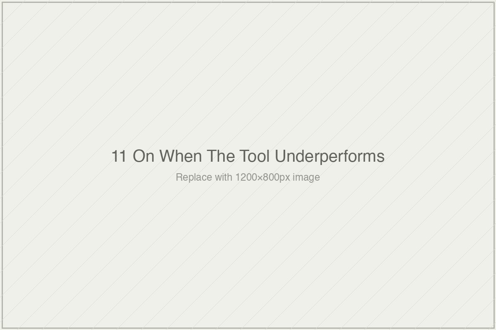

# On When the Tool Underperforms

*Essai 11*

---

## What Speaking Plainly Costs

---

In April 2023, Sal Khan stood on a TED stage and said we were at the cusp of "probably the biggest positive transformation that education has ever seen" — a personal tutor for every student on the planet, delivered by generative AI. In April 2026, he sat for an interview with Matt Barnum of *Chalkbeat* and described Khanmigo's impact on most students as "a non-event." His colleague Kristen DiCerbo, Khan Academy's Chief Learning Officer, said in the same interview: "So far I am not seeing the revolution in education." She named the specific evidence that gave the acknowledgment its weight — the dialogue data showed more "IDK IDK" than substantive engagement, students typing *I don't know, I don't know* into the Socratic prompts Khanmigo had been designed to deliver. Three years. A civilizational claim at the start, an institutional acknowledgment at the end, and the question the eleventh essai of *[book]* asks: what does a field do when its tools publicly underperform the claims that launched them?

The answer, the essai shows, is a pattern — six specific rhetorical moves that recur with linguistic signatures detectable across every generation of educational technology. Implementation blame. User blame. UX friction attribution. Extending timelines. Narrowing the claim post-hoc. Shifting the standard of comparison. These moves are not fraud. They are often deployed by sincere people, because the institutional incentives of the EdTech industry reward their deployment and punish the honest alternative. The essai's taxonomy is analytical — each move is characterized in its linguistic form, documented with Khanmigo-specific instances, and traced to historical precedents in the MOOC era, the Knewton arc, and the four-decade ITS tradition. What emerges is a diagnostic framework: a reader who recognizes the moves can calibrate their belief in any organization's current framing accordingly.

The essai's structural innovation is the seventh move. The move that is rarely performed. The honest description of the gap between claim and evidence, without deployment of the six deflections. The move Khan Academy made, in April 2026, when DiCerbo and Khan could have deployed any of the six and did not.

I want to read the essai carefully and then sit with what the seventh move costs, because the cost is where the essai's moral weight lives and where Baldwin's voice can do the work the book's register is most inclined to keep quiet.

---

The six moves the essai catalogs each have a legitimate version and a rhetorical version, and the distinction is the analytical discipline the essai offers the reader. Implementation does matter; the Pane RAND 2014 Cognitive Tutor study documented a real second-year effect attributable to school-level institutional learning. Users do vary; students with different self-regulation capacities engage with self-paced tools differently, and that variation is not fabricated. UX does affect outcomes; good interfaces produce different results than bad ones. Timelines sometimes extend legitimately; some interventions produce delayed effects that a first-year measurement would miss. Claims sometimes refine appropriately as researchers learn what their tools actually do. Comparison standards sometimes shift appropriately when the right comparator becomes clearer.

The three features that distinguish legitimate from rhetorical uses of each move, the essai specifies, are these: a specific mechanism connecting the move to the outcome it explains, a specification of what evidence would falsify the move's claim, and an engagement with the implications for the original claim — including the willingness to retract the original claim if the move turns out not to hold. The Pane finding was legitimate implementation-timeline extension because it carried all three: a specified mechanism (school-level learning), a specified falsifier (no effect in year two would have completed the null finding), and an engagement with what it would mean if the claim didn't hold.

The rhetorical versions typically lack one or more of the three features. Implementation blame without mechanism — *what specifically* about the poor implementations produced the failure? Timeline extension without falsifier — *what evidence* in year three would finally show the move was wrong? Claim narrowing without engagement — *how does the narrower claim relate* to what was said at the beginning? When a move is offered without these features, the essai argues, it is probably doing rhetorical work rather than analytical work. The framework is not an algorithm; it is a set of markers the careful reader learns to detect.

This is what analytical apparatus looks like when its subject is talk rather than measurement. The earlier essais of the book built tools for reading studies. This one builds a tool for reading the statements organizations make about their studies, their products, their trajectories. It is the tool the moment most requires, because the volume of EdTech rhetoric substantially exceeds the volume of rigorous EdTech evidence, and the rhetoric is what most readers encounter first.

---

What the essai names, almost in passing, is the structural reason the six moves keep appearing. I want to sit with this longer than the essai does, because the institutional analysis is where the moral weight of the seventh move becomes legible.

EdTech organizations — whether non-profits like Khan Academy or venture-backed companies like Knewton — depend on sustained narratives of transformative impact to maintain their funding environments. Philanthropic funders reward confident claims about impact. Investors reward scale and momentum. District partners reward the appearance of coherence and traction. Media coverage rewards novelty and the possibility of transformation. Microsoft's cloud-computing credits, partnerships with OpenAI, teacher adoption rates — all are shaped by the narrative the organization can sustain. An organization that publicly acknowledges that its revolutionary product has been a non-event is an organization whose next funding cycle, next district partnership, next media appearance will be harder to secure. The incentives do not reward honesty. They reward the maintenance of the narrative.

Cass Sunstein's framing of "availability entrepreneurs" — actors whose institutional position depends on sustaining attention to a particular claim — describes the specific pressure on people like Sal Khan. Khanmigo is not merely a product; it is Khan Academy's claim on the AI-in-education conversation. Retreating from the claim has consequences that extend beyond the evaluation of the specific tool. Larry Cuban documented in *Oversold and Underused* (2001) that this pattern has held across every twentieth-century wave of educational technology: radio, instructional television, CAI, educational computing, online learning. Each wave produced inflated initial claims, then a deployment gap, then rhetorical management of the gap through implementation or user blame or post-hoc narrowing, then quiet replacement by the next wave without substantive resolution of whether the previous wave had worked. The pattern is not a failure of character; it is the structural response of a field whose institutional rewards favor its production.

Which means the seventh move — the honest acknowledgment — is not simply a move that some actors make and others do not. It is a move the field's structure specifically punishes. When DiCerbo said publicly that she is not seeing the revolution, she said it knowing what the statement would cost Khan Academy in its next conversations with funders who prefer the maintained narrative. When Sal Khan described Khanmigo as a non-event for most students, he said it knowing that the competitive landscape of AI-in-education rewarded companies whose founders continued to talk the way he had talked in 2023. The acknowledgment was not free. It was, specifically, an act of absorbing cost that the institutional logic said should be deflected.

Sebastian Thrun said something similar in 2014, at a moment when Udacity's MOOC completion rates had produced what they produced. "We have a lousy product," Thrun said, "one that did not provide a good service to our students." The 2014 statement was a seventh move at the moment it was made, and it was followed — the essai notes this soberly — by a subsequent trajectory that did not hold to the honesty. Udacity pivoted to corporate vocational training, abandoned the degree-replacement framing, and the broader arc of Thrun's public rhetoric returned, over time, to the kind of confident claims the 2014 moment had briefly suspended. This is the hard question the essai raises but does not quite answer: does honest acknowledgment stick, or is it absorbed into the next hype cycle after the acknowledgment has passed?

The distinction matters because honesty without subsequent discipline is not, finally, different from the rhetorical moves it briefly interrupts. An organization that names the gap between claim and evidence in one interview and then returns to maintained narrative in the next has not, in the long term, done the work the seventh move requires. Khan Academy's April 2026 acknowledgment is credited by the essai as significant precisely at the moment it was made; what the organization does in the subsequent months and years — whether it commits to the measurement practices Essai 10 specified as necessary, whether it continues to describe Khanmigo's performance honestly as further evidence accumulates, whether it resists the institutional pressure to narrow the claim post-hoc — will determine how the full arc ultimately reads. The seventh move is not a one-time act. It is a sustained disposition, and the sustainment is the part the institutional incentives most strongly oppose.

What Baldwin would have said about this pattern, I think, is what the essai approaches but does not quite name. The machinery of rhetorical deflection exists because the cost of speaking plainly is distributed asymmetrically. The organization that speaks plainly absorbs the cost. The organizations that deploy the six moves do not. In a system structured this way, honest acknowledgment is not just rare; it is specifically disadvantaged. The fact that it happens at all — that DiCerbo said what she said knowing what it would cost Khan Academy — is what makes it worth naming. The fact that it rarely happens is what makes it worth examining. What the essai does, by treating the seventh move as an analytical category rather than as individual virtue, is relocate the question from character to structure: what would a field have to look like to make the seventh move ordinary rather than exceptional? What would the incentives need to reward to produce an EdTech industry whose institutional rhetoric matched its institutional evidence?

The essai does not answer these questions directly. It is not, as the author notes in the closing, a prescription to the field. It is an apparatus the reader can use. But the questions are where the essai's analysis points, and the reader can follow the pointing.

---

What this essai does that a generic EdTech-hype critique would not is refuse both of the easy moves. It does not lapse into cynicism about the field's integrity. The six rhetorical moves are not characterized as deception; they are characterized as the structural responses of sincere people operating inside an incentive structure that favors them. Many of the people who deploy implementation blame or timeline extension or claim narrowing are not dishonest. They are doing what the institutional logic of their position rewards. The essai's discipline is in holding both facts at once: the moves are detectable as rhetorical work, *and* the people making them are not typically bad actors. The moves are the artifacts of the structure more than the artifacts of the individuals.

The essai also refuses the easier credit move. Khan Academy's April 2026 acknowledgment is credited specifically, with the Thrun parallel drawn carefully — credit for the moment the statement was made, without claiming that subsequent trajectory will hold to it. This is what careful moral assessment looks like when its subject is institutional rather than individual: the act at the moment is what can be evaluated; the sustainment is an open question the essai declines to close.

I want to notice, because the author cannot say it directly without sounding self-congratulatory, that the essai's method matches the book's method. Every essai in this volume has closed with a section titled "What I am not sure about, and what I am asking from you." The author has, in each case, named the places the argument might be too compressed or too confident or too sympathetic or too harsh. This is the seventh move performed at the level of the book itself. The author is not claiming the analytical framework is complete, not claiming the cases are handled with equal rigor, not claiming the distinction between legitimate and rhetorical moves produces clean answers in every instance. The claims are held openly, with the uncertainty specified. This is what the book credits Khan Academy for doing in April 2026, at the level of its own authorship.

The structural observation is that the book is practicing, in miniature, the disposition it asks the field to consider. A volume whose subject is the pattern of rhetorical deflection in learning-systems research has organized itself, formally, as a resistance to that pattern. Whether the book's seventh-move disposition will produce readers who carry the disposition forward into their own work, or whether the volume will be cited for its numbers while its method is stripped in the way the earlier essais describe other careful works being stripped, is itself a question the book cannot answer. The book's method is its best defense, and its best defense is also what most invites the stripping it warns against.

---

What the reader carries forward is the diagnostic apparatus the essai builds. Six moves, each with legitimate and rhetorical versions. Three markers — mechanism, falsifier, engagement — that distinguish the two. One rare seventh move, the honest description, which the field's incentives specifically punish. When the next EdTech organization responds to disappointing evidence about its product, watch for the moves. Notice which appear. Notice whether the three markers accompany them. If the markers are absent, the response is doing rhetorical work, regardless of the sincerity of the people making it. If the response instead names the gap without deploying the machinery, the organization is absorbing cost the institutional logic said they should deflect, and the act is worth crediting at the specific moment it is made.

The rhetorical machinery of a field that has developed elaborate ways of protecting claims from evidence is not, the essai is careful to say, a product of bad actors. It is what emerges when funders reward confidence, partners reward momentum, media reward novelty, and honest acknowledgment of disappointing evidence has no institutional home. The seventh move is rare because the field is organized, at scale, to make it costly. DiCerbo in April 2026 paid a specific cost for saying what she said. Whether other organizations, watching her pay it, conclude that the cost is worth absorbing — whether her act becomes a model or an anomaly — is the question the subsequent months and years will answer.

Bloom's number escaped its conditions. Anderson's caveats escaped their paper. The ITS tradition's careful limitations escaped their researchers. What circulates in this field, across every wave, is the claim without the care. The essai points at what it would mean for the claim and the care to travel together — for the seventh move to be not just a rare act of institutional discipline but the default shape of how organizations describe their own products. The book is not sure the field will move in that direction. Neither am I, reading the book. But the essai has made it impossible, going forward, to encounter a rhetorical move of the six kinds without recognizing it, and that recognition is the specific shift in the reader that the essai was built to produce. What you do with the recognition, after you have it, is the part the apparatus cannot determine for you.

---

**Tags:** Khanmigo 2023 2026 arc underperformance, Kristen DiCerbo revolution acknowledgment, EdTech rhetorical moves Larry Cuban, institutional incentives availability entrepreneurs, Sebastian Thrun Udacity lousy product 2014
