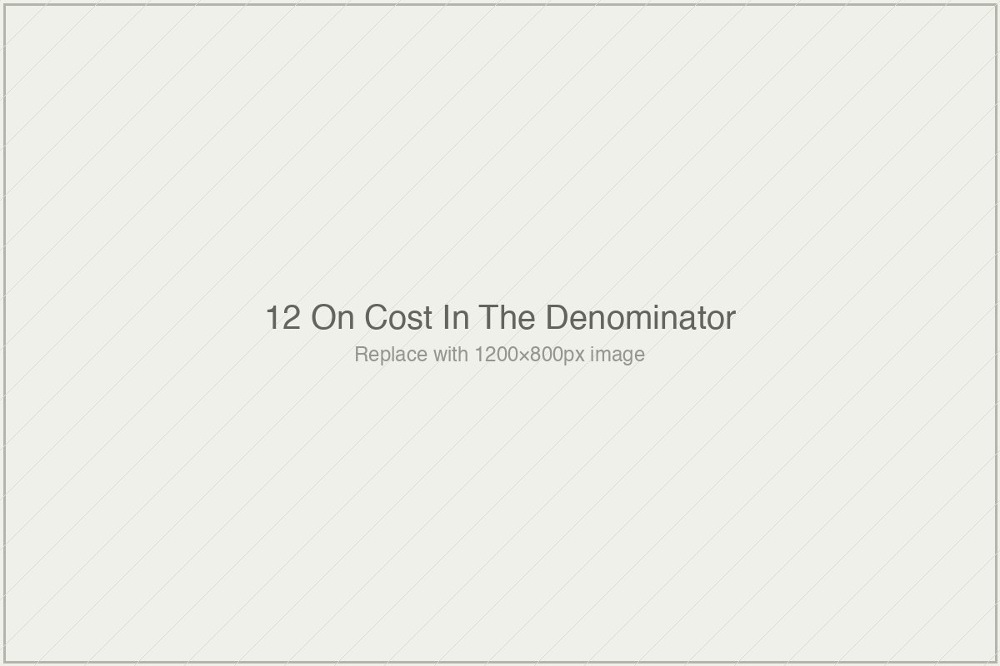

# On Cost in the Denominator

*Essai 12*

---

The essai opens on a phrase Benjamin Bloom used in 1984 that the field has spent forty years learning to forget.

*Too costly for most societies to bear on a large scale.*

Bloom used the phrase not at the margin of his 2-sigma paper but at the center of it. The paper was called *The 2-Sigma Problem*, and the problem — as Bloom named it — was not the finding. The finding was almost incidental to the architecture of the paper. The problem was that one-to-one tutoring with mastery learning produced an enormous effect and could not be afforded at scale. Bloom was not celebrating a result. He was naming a constraint. His paper asked a question: *how do we produce this effect at a cost society can bear?*

Forty years later, the field cites Bloom's answer and has mostly forgotten Bloom's question.

This is the observation the essai is built around, and I want to credit how cleanly it is stated. The 2-sigma number travels through contemporary AI-tutor discourse as a benchmark of what effective instruction can achieve. Its cost context — the "too costly for most societies" framing that was the reason the paper existed — has been stripped out of the citation. The field kept the answer. The field dropped the question.

Restoring the question is what this essai is for.

---

### What the Essai Refuses to Do

The obvious move, once cost is back in the comparison, is to produce a new ranking. Sigma-per-dollar. Rori beats Bloom 144 to 1. Khan Academy beats Saga by multiples. The technology-utopian gets their vindication; the tutoring advocate gets their defeat. A counter-ranking with the denominator now included.

The essai refuses that move.

What it says instead, carefully and more than once, is that the productivity frontier is not a ranking. It is a two-dimensional space where cost and effect size together determine position, and where different interventions occupy different regions, each appropriate to different contexts and resource environments. Rori's 0.072 sigma per dollar is not a finding that Rori is "better" than Bloom. It is a finding that Rori and Bloom were never on the same axis in the first place — and that the single-axis comparisons the field has been making for forty years were analytical errors the cost denominator now makes visible.

This is the discipline the essai is holding. Cost does not resolve the cases into a cleaner order. It reveals that the order was wrong to begin with. The essai could have monetized its cost walk-through into a new ranking that would be easier to remember and easier to cite and would almost certainly circulate more successfully than the framework it proposes. It does not. The sigma-per-dollar calculations are in the essai because they are load-bearing evidence for the productivity-frontier framework; they are not in the essai as rankings, and the writer is explicit about this more than once.

Whether this discipline holds against the gravity of contemporary discourse is, I think, an open question. The reader who skims the essai and extracts "Rori: 0.072, Saga: 0.00006" will produce a cost-ranking regardless of what the essai says about productivity frontiers. The writer cannot prevent this. What he has done is provide, inside the essai, enough structural language that the careful reader can tell the difference between what the numbers are and what they are likely to become when they travel. That is what an honest writer can do. Whether it is enough is not a question the essai can answer.

---

### The Frontier and Its Genealogy

The deep work of the essai is in its middle, where the productivity-frontier framework is grounded in an existing methodological tradition the EdTech field has simply failed to adopt.

Henry Levin's ingredients method, developed across the 1970s and 1980s, specifies that a program's true cost is the value of all the resources required to implement it, regardless of who pays for them. Matthew Kraft's recent work on effect-size interpretation argues that the field's reliance on Cohen's benchmarks has led to the dismissal of interventions that are small-in-magnitude but large-in-policy-relevance. Kraft's schema interprets effect size in light of three factors: the outcome measured, the study features, and the program cost. And the Abdul Latif Jameel Poverty Action Lab — J-PAL, founded by Abhijit Banerjee and Esther Duflo, whose work earned them the Nobel Prize in Economics in 2019 — has been conducting cost-inclusive randomized controlled trials of educational interventions for nearly two decades. J-PAL's reporting convention uses "standard deviations gained per $100 spent" as standard output. Cost-inclusive efficacy reporting has transformed the study of educational intervention in developing-country contexts.

It has not transformed the study of educational technology in high-resource contexts.

This is the gap the essai wants you to see, and it is the gap that gives the argument its specific weight. The methodological tools for honest cost-inclusive comparison have been available for decades. Levin specified the ingredients method in 1983. J-PAL has been operating under cost-inclusive reporting conventions since the mid-2000s. These are not exotic approaches. They are the mainstream practice of adjacent fields — fields working on the same problem (*how do we know if an educational intervention works?*) with better methodological discipline. The EdTech field has not adopted them. The question the essai circles, without demanding an answer, is why.

The writer names three structural features of the non-adoption. Cost is typically reported in methods appendices rather than in findings sections, which means citations strip the cost out. EdTech industry communications almost never normalize effect size by cost, because the unnormalized sigma looks more impressive. Academic conventions in educational psychology have not required cost reporting as a condition of publication. These three features — appendix burial, rhetorical framing, discipline-level convention — produce the cost-blindness structurally, without requiring individual bad faith from any researcher or company.

This is the essai's Baldwin move, and it is the reason the critique holds. The writer could have framed cost-blindness as a moral failure of the field. He does not. He frames it as a structural feature produced by incentives that reward the omission. Individual researchers doing careful work within conventions that do not require cost reporting are not being dishonest; they are being conventional. The convention is where the problem lives. This reframing matters because structural critiques can be answered by changing structures, while moral accusations can only be denied or absorbed. The essai wants the structures changed.

Whether the field will change them is, again, not a question the essai can answer. But it names the three features precisely enough that someone who wanted to change them would know where to start.

---

### The Cases, and the Paradox They Reveal

What the cost walk-through reveals, when you hold it at the level of structure rather than at the level of ranking, is a specific paradox the essai names directly and holds without flinching.

Saga Education's high-dosage tutoring runs at $3,500 to $4,800 per student per year and produces effects of approximately 0.25 sigma — a sigma-per-dollar of 0.00006, the lowest figure in the essai's entire walk-through. By the productivity frontier's efficiency axis, Saga is the least efficient intervention the book has examined. At the same time, Saga produces the most durable effects in the hardest-to-reach student populations. Both of these facts are simultaneously true. The essai does not pick one.

This is the move the essai is most disciplined about. The sigma-per-dollar comparison, taken alone, would license the claim that Saga is a poor use of resources. The baseline-and-population comparison, taken alone, would license the claim that Saga is an essential intervention whose cost is justified by what it achieves with students other interventions cannot reach. The essai insists that both framings are partial. Saga occupies a specific position on the productivity frontier: high cost, moderate sigma, durable effect in high-need populations. That position is not the same as being "efficient" or "inefficient." It is a location. Whether it is the right location for any given deployment decision depends on the context of the decision.

The same holds for Rori at the other end. Rori's 0.36 sigma at $5 per student per year is dramatically more efficient by the productivity frontier's cost axis — 144 times more efficient than Bloom's 2-sigma benchmark, by the essai's calculation. But the Ghanaian baseline against which Rori was evaluated is substantially weaker than the baselines against which Saga or Kestin or Khan Academy were evaluated. A $5 intervention producing 0.36 sigma in a context where the counterfactual is under-resourced mathematical instruction is not the same finding as a $5 intervention producing 0.36 sigma in a well-resourced context. The denominator matters. The baseline matters too.

What the essai achieves with this paradox is a specific refusal. It refuses to turn the cost walk-through into a story about who wins. It insists, page after page, that the point is not to rank but to see the two-dimensional space the field has been flattening into a single line. Each intervention is a point in that space. Different points are appropriate for different purposes. The question the field should be asking is not "which intervention is most effective?" but "which position on the productivity frontier best fits the decision I am making?" These are different questions, and the difference is the essai's contribution.

---

### The Register Question, and the Close

I want to name one concern before closing.

This essai is more quantitative than anything else in the volume. Specific dollar figures, specific sigma values, specific sigma-per-dollar fractions. The writer himself flags this in his closing note — he is not sure the Montaignian register survives the density of figures, and he asks the reader to tell him where it slips. My reading is that it holds, mostly, but there are passages where the essai reads more like a cost-effectiveness paper than like an essai, and the difference matters for how the argument will be received. A reader looking for the provisional, revisable, essai-ful voice that the earlier entries in the volume established may find this one more technical than the register accommodates. The writer's own worry on this front is warranted.

Whether this is a problem depends on what you think the essai is for. If it is the volume's hinge point — the place where the book moves from diagnosing evidence-apparatus problems to specifying how the apparatus would need to change — the quantitative density is necessary. The productivity-frontier framework cannot be argued in Montaigne's register alone. The sigma-per-dollar calculations are the evidence. Without them, the framework is a gesture. With them, it is a specification. I think the essai makes the right trade, but it is a trade.

What the essai asks you to carry is a sequence of questions for any future EdTech efficacy claim. What was the effect size. What did the intervention cost, honestly accounted. What is the sigma-per-dollar. Where does this intervention sit on the productivity frontier relative to alternatives at matched cost. What does the cost-normalized comparison reveal that the raw sigma comparison concealed.

These five questions are sharper than the two that closed the essai on engagement evidence. They are a direct extension of the five-question apparatus Essai 2 installed, now pointed at the cost dimension that the earlier apparatus mentioned but did not center.

What the essai does, finally, is notice what has been sitting in plain view. The methodological tradition for cost-inclusive efficacy work is not something someone has to invent. Levin specified it. Kraft has extended it. J-PAL has been practicing it for two decades. The tradition has been available to the EdTech field, in the open, for longer than most current EdTech researchers have been publishing.

The essai's contribution is to say, specifically and with the numbers in hand, that the non-adoption is where the work is. Not at the methods. Not at the studies. At the conventions that let the denominator drop out.

Bloom asked a question. The field kept his answer. The essai puts the question back.

---

**Tags:** Bloom 2-sigma problem cost framing, Henry Levin ingredients method cost-effectiveness, J-PAL Banerjee Duflo educational RCTs, productivity frontier versus sigma ranking, Saga Rori Kestin sigma-per-dollar comparison