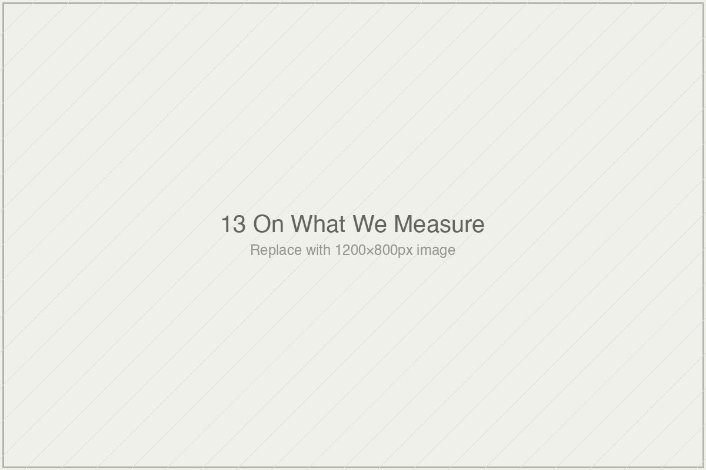

# On What We Measure and What We Care About

*Essai 13*

---

The essai opens on two findings forty years apart, and wants you to see what they share.

Bloom's 1984 paper reported students tutored one-on-one under mastery-learning conditions performed two standard deviations above students in conventional classrooms. The finding has been cited tens of thousands of times. It is perhaps the single most-invoked benchmark in educational technology.

Kestin's 2024 Harvard physics paper reported an AI tutor outperforming conventional active-learning instruction in an introductory physics course. The effect size exceeded what prior literature typically reported for any tutoring intervention, Bloom included. The finding circulated quickly.

Forty years. Different technologies. Different traditions. Different specific methodologies.

Read carefully, the essai says, the two findings share a structure. In each, a specific measurement — aligned-item performance at short timescale, against a conventional-instruction baseline — is offered as evidence for a construct about which the measurement is not, strictly, a measurement. Bloom's 2-sigma is evidence about performance on aligned items under particular tutoring conditions. It is *cited* as evidence about tutoring as an instructional mode. Kestin's physics finding is evidence about short-timescale aligned-item performance in a selective undergraduate population. It is *cited* as evidence that AI tutoring outperforms human instruction in some general sense the measurement does not index.

The measurements are not false. The findings are not inflated. The researchers reported carefully what they measured, and what they measured is what they found. The question the essai takes up is what happens between the measurement and the citation.

This is the volume's hinge essai — the thirteenth of fourteen — and what it does is state the analytical distinction the previous twelve have been circling. The measure-construct distinction. What the apparatus indexes versus what the vocabulary surrounding the apparatus claims. The gap has been implicit across the book's close readings. Here it is made explicit.

Whether stating it explicitly adds to what the book has already done, or merely summarizes it, is a question the essai has to answer in its execution.

---

### What the Essai Refuses to Be

I want to name, before anything else, what this essai could have become and does not.

It could have become an indictment. The vocabulary walk-through at the essai's middle — *learning* as Bjork understood it (storage versus retrieval strength), *understanding* as Lave and Wenger understood it (situated practice, not item performance), *mastery* as Bloom himself understood it (structural reorganization of knowledge), *personalization* as the aptitude-treatment-interaction literature understood it (real responsiveness to individual learners), *engagement* as the psychological literature understood it (attention, motivation, affect, meaningful cognitive investment) — would have licensed the obvious move. *The field has been claiming constructs its measurements do not index. This is not careful research. This is category confusion dressed in the language of science.*

The essai does not make that move. It says, precisely, that the gap between measurement and construct is not a problem specific to educational technology. It is a feature of empirical inquiry in every field. Biology works this way, and so does physics, and so does nutrition research. Measurements never exhaustively capture their constructs. The question for any field is how seriously it takes the gap, how much work it does to establish the measurement-construct relationship, and how much of that relationship it assumes versus demonstrates. The learning-systems field's particular failure is not that it has the gap. It is that it has, across six decades, taken the gap less seriously than its claims require.

That is a specific distinction, and I want to credit it. The essai refuses to frame the field as peculiarly bad at something every empirical field contends with. It frames the field as having specific production conditions that reward taking the gap less seriously than the claims justify. This is a structural critique, not a moral one. And it is the only kind of critique the book could make, at this point, that would not undo its own careful restraint.

---

### The Equilibrium, and What It Changes

The deepest move in this essai — and I think this is the move that makes the book hold together rather than merely end — is in the section the writer titles *Why the apparatus persists.*

Most critiques of educational-technology research locate the problem in individuals. Researchers are sloppy. Vendors are self-interested. Journal editors are captured. Philanthropists chase fashion. Each of these locations has a literature, and each literature is partially correct, and none of them produces change. The writer names this, briefly, before moving past it.

What he offers instead is an equilibrium argument.

The apparatus persists, he says, because it serves the specific production conditions of the field. Researchers need grants, which come on two-to-five-year cycles. They need publications, which require findings that fit existing conventions. They need access to study populations, which depends on institutional partnerships with their own timelines. They need findings that can be cited by subsequent researchers, which requires the findings to fit what subsequent researchers are working within.

A more adequate apparatus would require transfer testing (which depresses effect sizes), durability testing (which extends study timelines past grant cycles), multi-paradigm convergence (which demands methodological range most research programs do not possess), pre-registration (which constrains the exploratory moves that produce publishable findings), cost-inclusive reporting (which introduces unfavorable comparisons). Each of these, if adopted, would reduce the rate at which researchers produce citable positive findings. Not because interventions do not work — some do — but because findings surviving the more demanding methodology would be smaller, noisier, less rhetorically useful.

Then comes the sentence I keep returning to.

*No individual in this system is behaving cynically. Researchers are doing their best work under the constraints of their funding. Product vendors are reporting findings that pass peer review. Policy bodies are making recommendations based on available evidence. Philanthropists are funding work that looks defensible. The apparatus is not what anyone chose; it is what the incentives produce when rational actors operate within them.*

This is the Baldwin move at its most characteristic. Baldwin repeatedly refused, in his essays on America, to let structural analysis be reduced to individual prejudice and refused, equally, to let individuals hide behind structure as though their choices inside it were unchosen. The writer is doing something similar here. The apparatus is structural. Individual actors are not cynical. Nobody chose this system. And yet the system's outputs are what they are because of how rational actors operate inside it, which means the actors are not exempt from the system just because they did not design it.

The consequence of the reframe is specific. If the problem is individual researchers making errors, the remedy is exhortation — tell them to do better. If the problem is an equilibrium, exhortation cannot work. Individual researchers inside the equilibrium cannot adopt the more demanding methodology unilaterally and continue to have careers. The remedy, if there is one, requires coordinated change across grant agencies, tenure systems, journal conventions, institutional practices, and funder expectations. Such coordination is rare. It has happened, occasionally, in specific subfields when structural pressures aligned. It has not happened in learning-systems research, and none of the current pressures would produce it.

This is why the book refuses the reformer's voice. It is not humility. It is analytical honesty. The reformer's voice is addressed to the wrong audience. A book addressed to researchers inside the equilibrium, telling them to do better methodology, would misunderstand what produces the methodology the field currently uses. What the book is doing instead — and what this essai makes visible — is addressing itself to the *reader* of efficacy claims. Not to the researcher who produces them. The distinction is load-bearing. The researcher is inside the equilibrium; the reader is outside it. What the reader can do, the researcher often cannot.

---

### The Shape of What Is Missing

After the equilibrium argument, the essai does something it could easily have gotten wrong. It describes the shape of what more adequate evidence would require — multiple outcome measures, durability testing, transfer testing, cost as first-class variable, pre-registration, population diversity — and it does this at exactly the moment when the preceding structural argument has made the description risky. A reader who has absorbed the equilibrium claim might read the shape-of-requirements section as a list of demands directed at the field, which would reintroduce the reformer's voice the essai has just refused.

The writer heads this off in a specific way. He says, plainly, that the list is not his list. It is the aggregate of what serious methodologists across transfer-testing, durability-testing, construct-validation, cost-effectiveness, and meta-science traditions have been advocating since before most readers of this book were born. The shape is not new. What the book is doing is gathering what the apparatus does not currently produce and describing its shape as a set, so that the reader can see the set as a set.

This framing holds, mostly. But the section is the essai's most vulnerable moment, because the list is still a list, and lists function as prescriptions whether they are intended to or not. A reader skimming the essai and extracting the six-item list will produce, in effect, a reform program — regardless of the essai's disclaimer. The writer cannot fully prevent this. What he has done is provide enough contextual framing that the careful reader can tell the difference between what the list is and what it is likely to become when it travels. Whether the careful reader will slow down enough to register the difference is a question the essai cannot answer.

The closing section — *The reader, integrated* — returns to the book's actual deliverable. Not a method. Not a checklist. A habit of attention. The reflex to ask, when an efficacy claim arrives, what the claim's measurement is, what construct the measurement is meant to index, whether the relationship between measurement and construct has been established or assumed.

That reflex is what the book has been developing through twelve close readings. This essai names it. The fourteenth, the writer tells us, will release the reader to it.

---

### What the Book Hands You

There is one concern I want to name before closing.

The habit of attention the book delivers is real. It is portable. It generalizes to efficacy claims the book never read. It does not require expertise in learning sciences to deploy. These are serious accomplishments.

What the habit cannot do, by itself, is survive contact with rhetorical gravity. The next Sal Khan talk will not be delivered under peer review. The next VanLehn-shaped number will travel free of its conditions. The next adaptive-learning vendor pitch will substitute engagement metrics for learning outcomes. When these arrive, the reader's habit of attention will be competing against well-designed citation cultures, polished advocacy materials, and decades of institutional momentum pulling the reader back toward accepting the claim at face value. The habit is real. The gravity is also real.

The essai does not promise the habit wins. It promises, more modestly, that the reader can now see what they are choosing between. The accepting and the interrogating are both choices. Before the book, accepting was the default and interrogating required equipment the reader did not have. After the book, the equipment is present. What the reader does with it in any specific moment is their work.

What the book is, then, is an apparatus for noticing apparatus. It does not reform the field. It does not propose a research agenda. It does not tell you which AI tutors work. It gives you the habit of asking what any specific claim would need to support what it is being cited as supporting, and of noticing, specifically, when the answer is that the claim has not been asked to support what the citation implies.

This essai names what was developed. The fourteenth, I am told, will hand it to you and step back.

That is the book. Not what to conclude. Not what to do. A structure for noticing, handed over, without instruction. What you do with it is your work.

---

**Tags:** measure-construct distinction efficacy claims, Bloom Kestin forty years apart structure, learning sciences apparatus equilibrium argument, Bjork storage retrieval strength transfer testing, habit of attention rhetorical gravity
